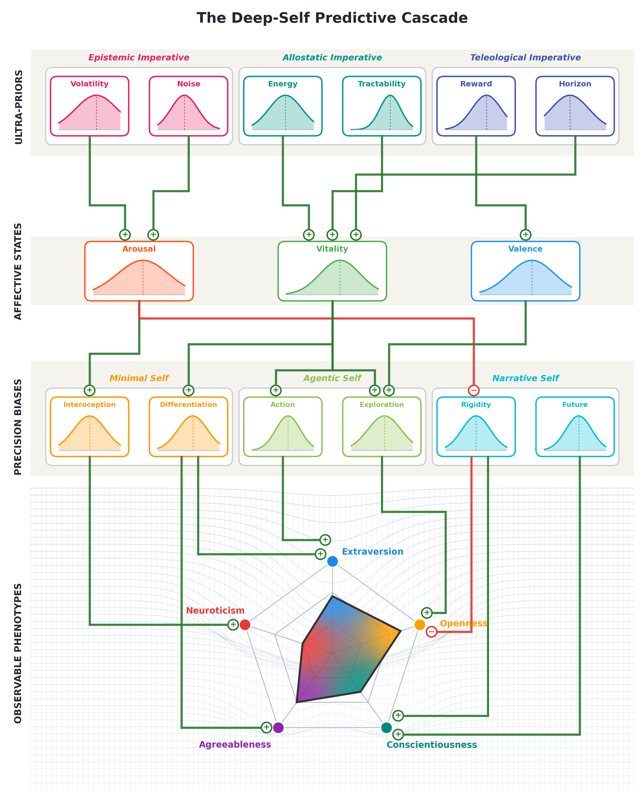

# The Deep-Self Model of Personality

Dominant personality models describe how people differ but not why those differences arise. The Deep-Self Predictive Cascade Model addresses this gap by deriving the major dimensions of personality from a small set of hierarchical expectations and precision-allocation strategies within the active inference framework. In doing so it recasts traits as the surface expression of an agent's generative model, unifying otherwise disparate taxonomies under a single formal ontology and yielding testable, mechanistic predictions for cognitive neuroscience and computational psychiatry.

- [**Paper**](paper/paper.pdf)
- [**Interactive app**](index.html)
- [**Simulation code**](simulation/simulation.py)

