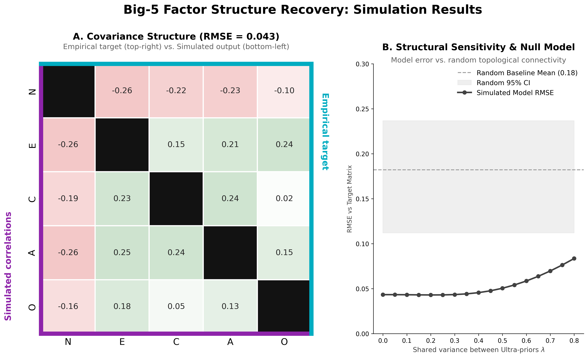

<!-- Target journals:
- Nature Human Behaviour
- Behavioral and Brain Sciences
- Psychological Review
- Trends in Cognitive Sciences
- Perspectives on Psych Science
- Personality & Social Psych Review
- Psychological Bulletin
- Physics of Life Reviews
- Neuroscience & Biobehavioral Reviews
- Neuroscience of Consciousness
- Computational Psychiatry -->


# Introduction

Personality psychology has produced robust, consensual descriptive taxonomies of human individual differences. The Big-5 Model [@costa1992neo; @goldberg1990alternative] replicates across cultures, methods, and informants, and predicts substantial variance in behaviour, health, and life outcomes [@roberts2007power; @soto2017next]. Its hierarchical extension into the meta-traits of Plasticity and Stability [@deyoung2006higher], and the Hierarchical Taxonomy of Psychopathology [HiTOP, @kotov2017hitop], which places maladaptive traits and symptoms on a dimensional continuum, show that this variance is not merely catalogued but structured. These frameworks describe what personality looks like with extraordinary reliability. By design, they do not explain why it takes that shape: why particular traits co-occur, why the same dimensions span clinical and non-clinical phenotypes, and why personality is so heritable yet shaped by experience.

This mechanistic gap has not gone unnoticed, and one line of research grounded in biology anchored traits in specific neural systems: cortical arousal and limbic reactivity [@eysenck1967biological], opponent motivational systems sensitive to punishment and reward [@gray1981critique], and the temperament-character distinction [@cloninger1987systematic]. While these accounts created successful frameworks for understanding biological instantiation, they typically remain domain-local, tied to one system without a unifying computational principle.

The cybernetic tradition, culminating in the Cybernetic Big-5 Theory [CB5T, @deyoung2015cybernetic] and rooted in perceptual control theory [@powers1973behavior], reconceives personality as the characteristic parameters of a goal-directed self-regulating system. It offers genuine mechanistic traction (Extraversion as reward-driven approach, Neuroticism as chronic goal-attainment failure, the Plasticity/Stability structure as the exploration-regulation tradeoff) and is the closest precursor to the present framework. But it remains verbal: it does not specify the form of the control computations or the mechanism by which regulatory failures become psychopathology.

The computational tradition has applied active inference and hierarchical Bayesian models to cognition, emotion, and psychopathology [@friston2017activeprocess; @clark2016surfing; @hohwy2013predictive; @smith2021recent], but largely in isolation from the taxonomic literature, leaving the empirical structure of the Big-5 and HiTOP unexplained rather than subsumed. Critically, the lack of a compelling mechanistic framework might have compounded issues related to the proliferation across frameworks of overlapping constructs that produced a jingle-jangle issue [@kelley1927interpretation; @bainbridge2022evaluating], impairing replicability, predictive and interpretative value, and conceptual clarity.

## The Free Energy Principle as a Unifying Framework

We draw our computational foundation from the Free Energy Principle [FEP, @friston2010free] and active inference [@friston2017activeprocess]. The FEP holds that any system that maintains its organization against entropy must act to minimize variational free energy, a tractable bound on the surprise of its sensory states under its internal generative model. Agents minimize free energy in two complementary ways: by perceptual inference, updating beliefs to fit the world, and by active inference, acting to make the world fit the model. Generative models are implemented as deep hierarchies in which higher levels predict lower-level activity and receive prediction errors in return [@friston2008hierarchical; @rao1999predictive], with precision weighting serving as the common substrate of attention, confidence, and affective valuation. Crucially, these hierarchies operate across nested timescales: fast perceptual inference is embedded in slower learning, which is embedded in the still slower updating of the deep priors that constitute the enduring self. This maps naturally onto personality, in which traits are defined by their stability. Under a predictive coding account, a trait is not a cause of behaviour but the computational signature of a slowly-updating configuration of prior beliefs and precision weightings, and personality can be conceptualized as *prior architecture*.

An agent's generative model defines a probability distribution over states of the world, and that distribution has a geometry. Some configurations of belief and policy correspond to low expected free energy (coherent, predictable, preferred) and others to high expected free energy (uncertain, costly, threatening). Behaviour gravitates toward the low-energy regions: the agent's deep priors warp the free energy manifold much as celestial bodies warp spacetime, carving the paths of least resistance the system tends to follow.

The low-energy *attractor basins* have a depth set by the precision of its governing priors, which translates in how much perturbation is needed to dislodge the system (i.e., how much energy is required to "push" the agent out of its constrained trajectory in that basin). High-precision priors create deep, rigid attractors that resist revision, and low-precision priors create shallow ones that update readily. A trait, on this view, is not something an agent has but a basin it falls into, and a personality profile is the macro-level topography of nested basins [see also @tschacher2007synergetics for a non-FEP based dynamical-systems proposal]. In this framing, trait co-occurrence becomes the signature of shared priors: Neuroticism couples reactivity, rumination, and somatic vigilance because a model expects a volatile world, a threatened body, and unreliable information. The Plasticity and Stability meta-traits track the exploration-regulation tradeoff that structures the FEP itself. And personality and psychopathology share variance because both are attractors in the same landscape, with psychopathology comprising configurations that are unusually costly, rigid, or maladaptive.

# The Deep-Self Predictive Cascade Model

The model proposes that this landscape is generated by a hierarchy in which parameter configurations at each level shape the states at the next (@fig-architecture). The cascade runs from foundational *Ultra-Priors* (deep expectations governing the agent's epistemic, allostatic, and teleological constitution), through core *Affective States* (Epistemic Arousal, Vitality, Valence) that summarize upstream signals, into *Precision Biases* that allocate attentional and volitional resources across the minimal, agentic, and narrative self-models, which then unfold into the observable *phenotypes* catalogued as personality traits.


At Marr's [-@marr1982vision] computational level, the framework is an active-inference account: personality variation reflects individual differences in deep priors and precision allocation within a free-energy-minimizing agent. While we theorize specific, directed links between discrete parameters, this topology is a deliberate conceptual simplification. In biological neural networks, connectivity is pervasive and multi-directional; the connective structure we describe is intended to highlight the functional "poles" of the system and its dominant pathways rather than map an exhaustive neural wiring diagram. Furthermore, true active inference relies on continuous, bidirectional flow, where unresolved prediction errors propagate upward to drive changes in higher-order expectations. However, to capture the enduring structural topography of personality, our framework emphasizes the top-down generative direction, which we primarily rely on in the simulations and didactic visualizations developed as part of this work.

As we remain largely agnostic as to the precise biological computations, mathematical mechanisms, or exact connection weights underlying these pathways, the open-source interactive application and simulation script accompanying this paper serve strictly as proof-of-concept approximations rather than complete algorithmic implementations of the model. We do not specify a joint generative density, perform variational inference, or select policies by expected free energy. Instead, these tools operationalize the cascade as a recursive structural-equation model with theoretically motivated path coefficients. In these simplifications, each downstream node is computed as a precision-weighted combination of its upstream inputs, incorporating selected multiplicative interactions:

$$
x_j = \frac{\sum_i \pi_{ij}\, w_{ij}\, x_i}{\sum_i \pi_{ij}}, \qquad \pi_{ij} = \frac{1}{\sigma_{ij}^{2}}
$$

with $w_{ij}\in[-1,1]$ the signed connection strength (positive for activating, negative for inhibiting projections). This precision-weighting language should be read as a motivated interpretation of the coefficients rather than a claim that variational message passing has been executed [@friston2008hierarchical]. The framework's contribution is therefore not new computational machinery but the theoretical motivation of a specific path structure: testing whether this topology generates the observed personality covariance. Importantly, our model does not seek to compete with the Big-5 or HiTOP as descriptions but offers a candidate mechanistic interpretation of the patterns they document.

Several commitments follow. The cascade does not derive the number of factors, nor claim that exactly six Ultra-Priors exist as discrete and specific substrates; each is likely better understood as a functional attractor in a larger system of nested priors, and the three-level structure is a minimum viable ontology, a parsimonious set of functional distinctions that generates the observed covariance with enough granularity to yield predictions. The number six reflects the orthogonal dimensions we judge sufficient to span the phenotypic space (see below), not a claim about the brain's parameterization, and we treat the set as a principled starting point rather than a closed inventory. Finally, the cascade's unidirectionality describes moment-to-moment information flow, not the impossibility of deep change: Ultra-Priors update slowly, but sustained therapeutic, pharmacological, or transformative experience that generates enough high-precision prediction error can revise them.

We accompany the model with an open-source interactive toy implementation (@fig-app) in which adjusting any Ultra-Prior propagates through the cascade in real time, serving as a working proof-of-concept that the proposed connectivity generates coherent, recognizable personality profiles from a small set of deep parameters. It is available, alongside the simulation code, at https://github.com/RealityBending/DeepSelfModel.

```{r}
#| fig-cap: "Screenshot of the open-source interactive companion application (https://github.com/RealityBending/DeepSelfModel). Users can adjust each Ultra-Prior, represented as a probability distribution whose mean encodes the expectation and whose width encodes the inverse precision, and watch the consequences propagate in real time across the core Affective States, Precision Biases, and observable phenotypes. The application operationalizes the cascade as precision-weighted message passing and serves as a functioning proof-of-concept and pedagogical resource rather than a formal computational model."
#| message: false
#| warning: false
#| apa-twocolumn: true
#| label: fig-app

knitr::include_graphics("figures/figure1.png")
```


## Ultra-Priors: The Deep Self

Ultra-Priors are the agent's most fundamental and entrenched beliefs about its situation: the slow-moving constitutional layer that sets the ceiling and floor for everything below. In active-inference terms they are the highest-order hyperparameters of the generative model, the parameters governing the parameters that govern prediction. They evolve on developmental timescales, are substantially heritable [@bouchard2003genetic; @vukasovic2015heritability], and are shaped by early attachment, culture, and learning history. Their effects are pervasive: a shift in any one reconfigures affective states, precision biases, and phenotypes simultaneously. They govern a system delimited by a *Markov blanket*, the statistical boundary of sensory and active states that partitions "self" from "world", and individual differences in the permeability and coupling of that boundary are central to what the framework explains.

We describe six Ultra-Priors, organized along three imperatives, corresponding to three core questions we believe a complete adaptive agent must implicitly answer. About the world: is the environment predictable and is sensory information reliable? About the body and action: do I have resources, and can my actions change outcomes? About value and time: are desirable states attainable, and is the future worth investing in? Each question targets a distinct, potentially orthogonal source of uncertainty, which is why we treat the priors as separable dimensions.

### The Epistemic Imperative

The Epistemic Imperative governs the agent's relationship with uncertainty through two parameters that dissociate the *dynamics* of uncertainty from its *baseline level* [@mathys2011filter; @mathys2014uncertainty].

*Volatility Expectation* encodes the prior belief about how rapidly the hidden causes of observations change, the expected rate of environmental non-stationarity. It relates to the $\omega$ hyperparameter of the Hierarchical Gaussian Filter [HGF, @mathys2011filter; @mathys2014uncertainty], whose recoverability from behaviour offers a direct empirical route to measuring it. High $\omega$ attenuates confidence in learned associations (raising the effective learning rate), keeps prediction errors chronically unresolved, and holds the agent in readiness for model revision: the computational substrate of anxiety-related disposition. It might be associated with noradrenergic gain control [@payzanlenestour2013neural] and is the primary upstream driver of Epistemic Arousal.

*Noise Expectation* encodes the agent's belief about irreducible, aleatoric uncertainty: the ambiguity expected to persist after the best possible model has been learned. Where Volatility concerns resolvable uncertainty about world structure, Noise concerns uncertainty the agent treats as irresolvable. This maps onto Yu and Dayan's [-@yu2005uncertainty] distinction between *unexpected* uncertainty (driving updating) and *expected* uncertainty (enabling tolerance of residual ambiguity). High Noise Expectation is permissive, but low Noise Expectation makes the agent expect its model to explain nearly everything: residual uncertainty demands correction, predisposing toward premature closure, cognitive inflexibility, and distress under ambiguity. Paired with high Volatility it is especially destabilizing: the agent expects its model to be both comprehensive and perpetually outdated.

### The Allostatic Imperative

The Allostatic Imperative governs expectations about the agent's metabolic and efficacy resources, its "body budget" [@barrett2017tce], dissociating the expectation of *having* resources from the expectation of *using them effectively*.

*Energy Expectation* encodes the prior belief about the state of the allostatic reserve: whether the body budget runs at surplus or deficit. Grounded in Barrett's [-@barrett2017tce] account of the brain as a predictive regulator of the body's metabolic economy, it represents the agent's long-run default prediction about that economy. High Energy Expectation presumes resources are available, generating a Vitality State that supports active coping, social engagement, and foraging; chronically low Energy Expectation presumes deficit, suppressing action and exploration in favour of conservation. Sustained low Energy Expectation, in interaction with the other priors, is the substrate of depressive and burnout states, understood as stable attractors driven by an expectation of metabolic insufficiency rather than as acute mood disturbance.

*Tractability Expectation* encodes the belief that the agent's actions can reliably reduce prediction error: the expected controllability of state transitions. It corresponds to perceived controllability, self-efficacy [@bandura1977selfefficacy], and, in FEP terms, the expected precision of proprioceptive signals and the sensitivity of outcomes to policy [@friston2011action; @adams2013predictions]. It governs both policy selection (high Tractability supporting approach and active coping) and the coupling of the Markov blanket to the social environment. Because ineffective action wastes resources, low Tractability both suppresses action (via Vitality and the Action-Perception Bias) and discourages social engagement (via the Differentiation-Dissolution Bias).

### The Teleological Imperative

The Teleological Imperative governs goal-directed orientation through two parameters fixing the *magnitude* and *temporal scope* of motivation.

*Reward Expectation* encodes baseline sensitivity to goal-attainment signals and the expected value of outcomes, the prior over preferred states, corresponding to the **C**-vector in active inference [@friston2016active]. It is distinct from hedonic pleasure and from Tractability: high Tractability with low Reward yields competent apathy, whereas high Reward with low Tractability yields frustrated approach drive, relevant to approach-motivated depression [@trew2011exploring]. Possibly related to tonic mesolimbic dopamine [@schultz1997neural], reward expectation simultaneously amplifies approach (Action-Perception Bias), foraging (Exploration-Exploitation Bias), and hedonic tone (Valence), making it the upstream anchor of the Behavioral Approach System and Sensation Seeking.

*Horizon Expectation* encodes the temporal depth of the policy space, how far the model extends predictions and plans, corresponding to the look-ahead depth *T* in tree-search formulations of active inference [@friston2017activeprocess]. In a way, it is the most existential of the priors: it encodes how the agent resolves the ultimate prediction error of its own termination. Horizon (a parameter of the generative model) must be distinguished from temporal discounting (a behavioural phenotype): steep discounting can arise from a shallow Horizon or from a deep Horizon combined with low Tractability or Reward, so isolating it requires paradigms that separate the depth of forward representation from the value applied to it. Horizon interacts with Reward to define a motivational space: high Reward with low Horizon yields present-oriented hedonic impulsivity; high Reward with high Horizon the ambitious, conscientious, long-term planning profile; low Reward with high Horizon a stoic, duty-driven configuration; and low Reward with low Horizon a truncated, disengaged profile (which can be an adaptive response to genuine uncontrollability, but when chronic might lead to a more maladaptive  nihilistic withdrawal). At its high end, a deep Horizon extends the self across time, supporting an orientation towards biological or cultural legacy (desire for family lineage or symbolic achievements). One reason we find the Horizon prior compelling is that it is the a parameter whose high end forces the agent to confront its own non-existence - which we propose is a core feature of a higher-order time-bounded agent, rather than a Human-centric artifact. 

## Core Affective States

Core Affective States are the first level of integration: the phenomenological signal that the agent's deep computational constitution generates as it engages with the world. It corresponds to the continuously generated interoceptive *predictions* of the agent's condition, updated by how closely the world conforms to its deep priors. Three dimensions dissociate affective experience more finely than the valence-arousal circumplex [@russell1980circumplex] while remaining computationally grounded. Higher-dimensional extensions of the circumplex are not new [@watson1999panasx; @posner2005circumplex]; our contribution is the specific identity of the third axis, separating Epistemic Arousal (uncertainty-driven) from incentive arousal, which is folded into the Valence-Vitality complex. Each state tracks one of the three problems an agent must continuously monitor: uncertainty (governing the imperative to *learn*), resource sufficiency and controllability (the imperative to *act*), and trajectory toward valued states (the imperative to *persist*). While we use the terminology of "States" to mark their phenomenological character, it is useful to note that our model is concerned with the *expected level* of each affective dimension, in which sense they function as trait-relevant dispositions rather than as the phenomenology of any given moment. The realized, momentary state is likely generated by the same machinery but additionally reflects immediate context and short-term prediction error, constituting the within-person variability the present framework does not formalize (see Limitations). 

Epistemic *Arousal* is the interoceptive consequence of unresolved, high-precision prediction error, the felt experience of world-opacity. Generated downstream of Volatility and Noise Expectation, it is phenomenologically distinct from reward-anticipatory (incentive) arousal [@russell1980circumplex]: high epistemic Arousal without positive Valence is anxiety; positive Valence co-occurring with elevated Vitality (i.e., high incentive arousal) is excitement. Dissociating the two from a generic "arousal" construct yields a specific prediction: interoceptive prediction-error sensitivity should load independently of reward anticipation even when both elevate autonomic arousal. Chronic Epistemic Arousal forces the agent onto its most reliable data stream, interoception, driving the Interoception-Exteroception Bias toward the somatic pole and eroding narrative coherence, predicting the observed association between trait anxiety, interoceptive sensitivity, and narrative-identity disruption.

*Vitality* is the correlate of the allostatic reserve, experienced as energy and drive at the high end, fatigue and burnout at the low. Generated from Energy, Tractability, and Horizon Expectation, it integrates allostatic, efficacy, and temporal signals into a scalar capacity to engage with the environment. It is the principal mediator between the allostatic priors and the Differentiation-Dissolution Bias: high Vitality supports social coupling, low Vitality triggers withdrawal.

*Valence* is the correlate of hedonic tone and anticipatory positive affect, tracking the direction and rate of movement through the free energy landscape rather than static position. It receives direct input from Reward Expectation. An inverse modulatory signal from Vitality enables the possibility of approach-motivated low mood: high Reward with low Vitality, an agent drawn toward outcomes it lacks the metabolic capacity to pursue. This maps onto agitated depression and helps explain depressive heterogeneity, from anhedonic presentations (low Reward driving low Valence) to preserved goal-directedness with severe impairment (high Reward with depleted Vitality). What traditional circumplex's "arousal" axis partly captures under its incentive/appetitive pole (incentive arousal) is, within our model, not a separate node but the joint elevation of Valence and Vitality (hence our choice to use 'Arousal' in its epistemic sense, which we believe is more accurate given its original definition as a state of being alert).

## Precision Biases: The Self

The third level describe priors governing the precision-allocation machinery: dispositional parameters governing how much weight the system places on different information sources, action strategies, and temporal frames. Stable *biases* in precision weighting system, which is the mechanism by which beliefs become attention and action. Precision biases are thus where stable priors and transient context meet, predicting that the same individual shows systematic, prior-consistent shifts in precision across situations.

The biases map onto the three canonical layers of self-organization. The Minimal Self governs the sensory and somatic boundary with the world; the Agentic Self governs epistemic and volitional engagement; the Narrative Self governs temporal continuity and autobiographical coherence. These register preferentially onto the three Imperatives, the Minimal Self shaped by the Epistemic, the Agentic by the Allostatic and Teleological, the Narrative by the Teleological, reflecting the model's claim that the architecture of selfhood derives from the three questions every agent must answer: what can I know, what can I control, and what should I seek.

### The Minimal Self

The *Interoception-Exteroception Bias* governs the weight placed on internal bodily signals versus external sensory structure for self-regulation. Linked to the Minimal Phenomenal Self [@metzinger2003being; @wiese2018experienced], the Proto-Self [@damasio1999feeling], and interoceptive inference [@seth2013interoceptive; @seth2021being], it is driven toward the interoceptive pole by chronic Epistemic Arousal: the agent uses its own aroused somatic state as primary evidence about the world's safety. High interoceptive bias also suppresses structural coupling with others, the implicit mechanism by which chronic anxiety produces social withdrawal. At the neurobiological level it is likely associated with insular and anterior cingulate function and the vagal tone continuum [@critchley2017interoception]. This is also consistent with Northoff's spatiotemporal account of self-disturbances, in which disruptions to the brain's resting-state temporal structure in default-mode and interoceptive cortices predict the degree of self-boundary dissolution in both healthy and clinical populations [@northoff2018brain].

The *Differentiation-Dissolution Bias* governs the structural coupling of the Markov blanket to other agents: Differentiation favours bounded, autonomous self-models; Dissolution favours synchrony that weakens the self-other boundary. It receives converging input from Vitality (surplus enabling engagement) and Tractability (efficacy permitting close coupling). It is the primary driver of Extraversion and Agreeableness, and might be linked with Panksepp's PANIC/GRIEF system [@panksepp1998affective], with separation distress as an abrupt, involuntary shift toward Differentiation following loss of a partner whose blanket had been partially incorporated into the agent's own self-model.

### The Agentic Self

The *Action-Perception Bias* governs whether the agent resolves prediction error primarily by changing the world or by changing its beliefs. Action-heavy parameterization (high precision on proprioception and motor commands) yields approach, assertiveness, and rapid engagement; perception-heavy parameterization yields reflection and accommodation. It is amplified by Tractability and Reward Expectation but stands in trade-off with the Exploration-Exploitation Bias, since the same resources cannot serve both active control and exploratory information-gathering, predicting that the small negative Conscientiousness-Openness correlation reflects a precision-allocation constraint rather than two independently varying dimensions.

The *Exploration-Exploitation Bias* governs the weighting of epistemic (information-gain) versus pragmatic (preference-satisfaction) policies, naturally expressed as the decomposition of expected free energy into epistemic and extrinsic terms [@friston2015active; @smith2022stepbystep], and closely related to curiosity [@kidd2015psychology; @parr2017uncertainty]. It comprises two sub-dimensions that share an upstream driver but differ in target. *Somatic Exploration*, epistemic foraging directed at the physical boundary, drives Sensation Seeking and risk-taking, a graded programme of injecting prediction error into the body to confirm the minimal self; this is why it is elevated under chronically high Epistemic Arousal, since when the narrative self is unstable, the body offers the most precision-certain self-confirmation. *Phenomenological Exploration*, foraging at the conceptual and narrative boundaries of the self-model, drives Openness to Experience and, at its extreme, the pursuit of altered states. Both are suppressed by Vitality deficit, elevated by Noise Expectation, and driven by Reward, predicting that reward sensitivity translates into active foraging only when metabolic resources are available.

### The Narrative Self

The Narrative Self is the diachronic self that integrates experience into autobiography and projects it into an anticipated future [@mcadams1993stories; @mcadams2001psychology; @metzinger2003being], sustained by hippocampal-default-mode binding. It is hierarchically higher-order, requiring a stable synchronic substrate, which predicts that disruptions to the Minimal Self impair narrative coherence even when narrative-processing systems are structurally intact.

The *Rigidity-Fluidity Bias* governs the precision assigned to autobiographical continuity. At the Rigidity pole the past self-model carries great weight and resists revision, yielding conservatism, deliberateness, and the stable goal-directedness underlying Conscientiousness. At the Fluidity pole the self-model updates readily, allowing flexible revision but risking fragmentation under high Epistemic Arousal. The latter might be the mechanism underlying the link between Openness and psychosis-proneness [@mason2005short]. This framing aligns with Northoff's spatiotemporal psychopathology, which locates schizophrenic self-disturbances in disrupted neural timescales rather than aberrant salience per se [@northoff2014unlocking], providing an empirical anchor independent of the dopaminergic account [@kapur2003psychosis]. It is interesting to consider that some individuals might display a U-shaped response in which threat produces defensive rigidification (dogmatism, identity foreclosure), a clinically important individual difference whose status as a stable parameter versus a situational precision shift is an open question. The precision assigned to autobiographical continuity maps onto what Northoff [-@northoff2018our] calls the "self-continuity" dimension of temporal self-constitution, which provides independent neuroscientific grounding for this Rigidity-Fluidity axis.

The *Future-Present Bias* governs the temporal discounting of predicted outcomes, the rate at which precision degrades with temporal distance. High Future Bias (low discounting) weights distal consequences nearly as heavily as proximate ones, enabling the delayed gratification observers rate as Conscientiousness; high Present Bias yields reactive, context-sensitive, impulsive profiles. It is bounded from above by Horizon Expectation and shaped by Tractability, predicting that a deep Horizon produces genuinely Conscientious behaviour only when actions are expected to be effective; deep Horizon with low Tractability instead produces ruminative future-orientation without follow-through, consistent with the anxious perfectionism of obsessive-compulsive presentations.

## Observable Phenotypes


```{r}
#| fig-cap: "The Deep-Self Predictive Cascade Model applied to the Big-5 traits. Foundational Ultra-Priors (top) propagate downward through the Core Affective States and the Precision Biases to generate observable phenotypes. Connections follow a control-systems idiom: each links a specific source to a specific target node with an activating or inhibiting (inverse) effect (note that this dominant generative direction is depicted for expository clarity; as the model actually supports a bidirectional prediction-error propagation mechanicsm). The warped grid alludes to the dynamical-systems framing in which phenotypes correspond to basins of attraction in a free-energy landscape."
#| message: false
#| warning: false
#| apa-twocolumn: true
#| label: fig-architecture
#| out-height: "80%"

knitr::include_graphics("figures/figure2.png")
```

# Mapping Existing Frameworks

From the complex interaction of the upstream parameters described above emerge macro-level behavioural and experiential patterns, which form the phenotypical constructs typically targeted by self-report questionnaires, clinical interviews, and behavioural assessment. The cascade's parameter space provides a common vocabulary onto which major frameworks in personality, affective neuroscience, and clinical science can be mapped. We propose that each captures a bounded subset of the structure the cascade describes, and that the regularities each documents are consistent with, and plausibly generated by, particular configurations. These are correspondences and causal hypotheses, not formal derivations; their value lies in the specific, testable predictions they yield, several of which the source frameworks do not generate.

## Trait and Dimensional Taxonomies

While our model does not perfectly predicts the Big-5 dimensions, we believe it offers an account of the *covariance* among these dispositions, driven by commonalities in their upstream configuration. *Neuroticism* arises from high Volatility with low Noise Expectation, propagating into chronic Epistemic Arousal and the Interoception Bias, buffered by an inverse projection from narrative Rigidity; its facets (anxiety, depression-proneness, irritability, self-consciousness) are the downstream bifurcation of the Arousal signal. *Extraversion* arises from Reward and Tractability converging on Valence and Vitality and then on the Dissolution and Action poles, the convergence of a social-synchrony stream and an approach-drive stream that co-occur without being identical, predicting that high Reward with low Vitality yields a withdrawn-but-motivated profile that standard questionnaires misclassify. *Openness* arises from high Noise Expectation with adequate Reward feeding Phenomenological Exploration and low Rigidity, with Intellect versus Openness-proper facets [@deyoung2007between] reflecting Phenomenological versus Somatic Exploration, the latter also locating Zuckerman's Sensation Seeking [@zuckerman1979sensation; @zuckerman1994behavioral; @zuckerman2006biosocial] at the high-Reward/Somatic pole. *Agreeableness* arises from Tractability and Vitality converging on Dissolution without the Action amplification of Extraversion (with the Future-Present Bias supporting stable, "shadow-of-the-future" cooperation [@bo2005cooperation]), predicting that allostatic depletion suppresses Agreeableness more readily than Extraversion. *Conscientiousness* arises from Tractability with deep Horizon propagating into Future Bias, Rigidity, and effective action, inversely predicted by Epistemic Arousal, and decomposing into a Rigidity-driven orderliness component and a Tractability-by-Horizon industriousness component with dissociable sensitivity to acute versus chronic perturbation.  We are less certain about *Honesty-Humility* [@ashton2007empirical], the 6th dimension from HEXACO/Big-6 models, but think that it might correspond to high Dissolution coupling under high Tractability, where exploitation registers as a self-model violation, predicting shared variance with Agreeableness but divergence on Tractability.

Psychopathological spectra are conceptualized in the HiTOP model as extreme or rigid configurations of personality traits, often defined by dysfunctional *interactions* rather than single-parameter extremity [@kotov2017hitop]. Under our model, *Internalizing* could be framed as chronic Epistemic Arousal with suppressed Vitality, the fear-versus-distress distinction tracking Vitality (adequate in phobia and GAD, low in depression) rather than Arousal, predicting that the fear-to-distress transition is driven specifically by Vitality change. *Externalizing* to high Reward and Action Bias with reduced Rigidity and strong Dissolution, specifically shallow Horizon with high Reward, distinguishing it from the deep-Horizon approach configuration that yields deliberate goal pursuit. *Thought Disorder* might correspond to high Epistemic Arousal with low narrative Rigidity, with delusions as the model's best-available narrative explanations for unintegrable prediction errors, predicting the schizotypy-Openness link [@mason2005short] without requiring a purely dopaminergic aberrant-salience account [@kapur2003psychosis]. *Detachment* would correspond to low Reward with Differentiation, anhedonia driven by low Valence independent of Arousal, predicting selective response to dopaminergic intervention. The transdiagnostic *p*-factor [@caspi2014pfactor] is the *product* of low Tractability and high Volatility: each deficit removes the route by which the other could be mitigated (uncertainty is tolerable when action can reduce it; uncontrollability is tolerable when the world is stable enough to learn passively), motivating a multiplicative rather than additive specification and predicting super-additive transdiagnostic severity (see predictions below). Two conditions illustrate deviations from typical architecture: *autism* maps onto very low Noise Expectation, a hyper-precise sensory model with no tolerance for residual ambiguity [@lawson2014aberrant; @vandecruys2014precise], predicting that social difficulty peaks under relational unpredictability; and *schizophrenia*'s positive-to-negative-symptom course tracks a collapse in Tractability under sustained arousal load [@tandon2009schizophrenia].

## Cybernetic and Motivational Frameworks

The cascade adopts Cybernetic Big-5 Theory's [CB5T, @deyoung2015cybernetic] central claim, that traits are parameters of goal-directed self-regulating systems, and extends it in three ways: it specifies the mathematical form of the control computations as precision-weighted propagation; it replaces a relatively flat trait structure with a generative hierarchy in which traits are derived from deeper configurations (locating Neuroticism's cause in the Volatility-Noise prior rather than treating chronic goal-failure as an explanatory terminus); and it introduces core Affective States as a principled intermediate level that CB5T acknowledges but does not model. The sharpest divergence concerns Tractability, which CB5T treats as a facet of Conscientiousness but our model treats as an Ultra-Prior upstream of Conscientiousness, Agreeableness, and inverse Neuroticism, predicting trans-Big-5 validity for computational Tractability measures that self-report cannot achieve.

Gray's Reinforcement Sensitivity Theory systems [@gray1981critique; @graymcnaughton2000; @corr2008reinforcement] are behavioural signatures of upstream configurations rather than priors themselves: BIS is elevated Epistemic Arousal suppressing Action, BAS is high Reward amplifying Action and Exploration, and the Fight-Flight-Freeze System is acute, high-amplitude Arousal. Reading questionnaire BIS/BAS scores as conflations of upstream priors and downstream output may explain inconsistencies in the literature. The key extension is the dissociation of BAS from Tractability: high Reward with high Tractability yields canonical energetic approach, whereas high Reward with low Tractability yields the frustrated-approach configuration of approach-motivated depression [@trew2011exploring], a directly testable interaction.

Cloninger's [@cloninger1987systematic; @cloninger1993psychobiological] temperament-character split aligns with the Ultra-Prior/Precision-Bias distinction: temperament dimensions map onto upstream priors (Novelty Seeking onto Reward with Somatic Exploration, Harm Avoidance onto Volatility with low Noise, Reward Dependence onto Dissolution, Persistence onto Horizon with Future Bias and Tractability) and character onto multi-parameter interactions, predicting that Cooperativeness (Vitality-sensitive Dissolution) declines before Self-Directedness (the more metabolically robust Tractability-Future Bias pathway) under allostatic depletion.

## Affective and Interoceptive Frameworks

Barrett's [@barrett2017tce; @barrett2016active] account of emotions as constructed allostatic predictions is in direct alignment with the cascade's treatment of core Affective States as continuously generated interoceptive predictions. The "body budget" corresponds to Energy Expectation and its downstream Vitality State, and is the primary motivation for locating the Allostatic Imperative at the Ultra-Prior level. The substantive departure concerns affective geometry: the cascade replaces the single arousal dimension of the inherited circumplex [@russell1980circumplex] with two generators: Epistemic Arousal, an explicit node driven by Volatility and Noise Expectation, and the joint elevation of Reward-driven Valence and Vitality, likely akin to incentive arousal, sharing peripheral sympathetic output but differing in upstream generators and autonomic signatures. This predicts a double dissociation, testable with measures separating parasympathetic withdrawal from sympathetic activation, that a single arousal dimension cannot produce.

Panksepp's Primary emotional systems [@panksepp1998affective; @panksepp2012archaeology] are affective signatures of parameter configurations: SEEKING (Reward with Exploration under adequate Vitality), FEAR (acute Epistemic Arousal), CARE (Dissolution under adequate Vitality and positive Valence), and PANIC/GRIEF (involuntary Differentiation following bond loss). Two mappings generate non-obvious predictions: RAGE as the consequence of a high-efficacy agent whose bounded approach policies repeatedly fail to reduce prediction error (distinct from withdrawal-based depression); and, because Vitality multiplicatively gates Exploration and Dissolution, SEEKING and CARE should be suppressed by allostatic depletion faster than by reductions in their respective reward priors, framing parental burnout and compassion fatigue as Vitality failures rather than failures of social motivation.

## Interpersonal and Existential Frameworks

Our model might be extended to pro- and anti-social traits. For instance, affective empathy might be related to a bias towards the Dissolution pole (the other's states enter the agent's interoceptive prediction system), whereas cognitive empathy requires low Rigidity plus adequate Exploration (temporary self-model updating to simulate another's perspective), and the two can dissociate. *Psychopathy* might be tentatively framed as emerging from high Reward, high Tractability, and shallow Horizon combined with constitutively low Epistemic Arousal [consistent with attenuated fear-potentiated startle and skin-conductance responding, @lykken1957study; @hare1991checklist] and low Dissolution.

Primal World Beliefs [@clifton2019primal] provide some of the most direct empirical anchors for the cascade's parameters. The *Safe* primal aligns with Tractability and high Noise Expectation (the world is bounded and legible) and the *Enticing* primal aligns with Reward Expectation, the prior over preferred states. The *Alive* primal is less straightforward: while its interpersonal warmth facet overlaps with the Dissolution pole, its core sense that the world is vibrant and dynamic plausibly reflects allostatic surplus projected outward. A high-Energy, high-Vitality agent perceives the environment as animated, whereas a depleted agent perceives it as inert or grey, independent of how bounded or unbounded their self-model feels. On this reading, Alive should correlate specifically with Energy Expectation and interoceptive-accuracy measures rather than with self-other boundary measures, constituting a discriminant prediction. Together, these three primals offer a potential validation strategy: Safe scores should decompose into a controllability component (Tractability) and an ambiguity-tolerance component (Noise Expectation), a direct test of the Epistemic Imperative's two-component structure.

Finally, it is worth noting that concepts from psychodynamic have already reframed in active-inference terms [@carhart2010default; @solms2018consciousness], and Jung's elusive archetypes have been cast as phylogenetically conserved structural priors, "shared eigenmodes" of the species-typical deep-prior landscape [@mcgovern2025eigenmodes]. Note that the alternative framing  by @becker2019archetypes as emergent outcomes of evolved motivational systems whose recurrence across cultures reflects shared adaptive pressures is not incompatible with our model: the former treats archetypes as the prior architecture's eigenvectors, the latter as the attractor basins that motivationally equivalent priors reliably generate.

# Simulation Proof-of-Concept

A minimal precondition for the framework is structural consistency: its fixed connectivity must be *capable* of producing the empirical covariance structure it seeks to explain. We tested this in a proof-of-concept simulation implementation ($N = 100{,}000$; open-source code at github.com/RealityBending/DeepSelfModel), in which each tier computes a precision-weighted combination of upstream inputs. Connection weights were set by hand to reflect the hypothesized directional, signed effects; crucially they were *not* fitted, tuned, or optimized against the empirical target, so the simulation tests whether the specified structure *can* reproduce the target, not whether it can be fit to it. Domain-specific noise bounds absorbed the trait variance attributable to context and item specificity, and shared variance among the Ultra-Priors ($\lambda = .35$) represented shared developmental ecology (e.g., a hostile environment simultaneously raising Volatility and lowering Energy and Tractability) and genetic pleiotropy.

```{r}
#| fig-cap: "Simulation results for the Deep-Self Predictive Cascade Model. Panel A displays the split-diagonal covariance matrix comparing the empirical target structure (top-right, derived from Digman, 1997 and DeYoung et al., 2002) against the simulated cascade output (bottom-left, N = 100,000), yielding an RMSE of 0.043 with matching signs across off-diagonal cells. Panel B shows a sensitivity analysis over varying shared variance among the ultra-priors: the simulated model RMSE (black circles) remains below the null model's 95% CI (grey band) across the precision range, which indicates that the fit does not arise from arbitrary parameterization of the cascade."
#| message: false
#| warning: false
#| apa-twocolumn: true
#| label: fig-simulation


```

With these hand-set weights, the simulated correlation matrix reproduced the meta-analytic target [@deyoung2015cybernetic; @digman1997higher] with matching off-diagonal signs and an RMSE of 0.043, accounting for roughly 30% of trait variance from the deep-prior configuration alone (@fig-simulation). To evaluate whether this fit reflects the *specific* connectivity the cascade proposes, rather than the generic flexibility of a 39-edge weighted DAG, we compared it against an Edge-Type-Matched Null (1,000 iterations): random DAGs preserving each node's per-tier in-degree, onto which the cascade's exact weights are assigned by edge type, randomizing only which specific nodes within a tier each connection links. This retains the model's full edge-type composition and weight magnitudes, varying only its node-to-node assignments. It produced a mean RMSE of 0.189 (95% CI [0.123, 0.248]), and the cascade model (RMSE = 0.043) outperformed it in all 1,000 iterations (*p* < .001), an advantage that was stable across the tested range of shared-variance values among the Ultra-Priors (@fig-simulation, Panel B).

This comparison indicates that the fit cannot be attributed to the model's edge-type composition alone but depends specifically on which nodes those connections link (e.g., that Volatility Expectation projects to Epistemic Arousal rather than to Vitality). While these results are promising, they do not, however, establish that the theoretical topology is the only configuration capable of this fit: with 39 signed free parameters mapping onto a target with 10 unique off-diagonal correlations, alternative topologies whose weights were optimized to the target, rather than transplanted from the theoretical model, might achieve comparable RMSE. What the comparison rules out is the weaker possibility that the fit is a generic consequence of connecting these tiers with this many edges of these magnitudes in some directionally consistent but otherwise unconstrained arrangement. Comparing the theoretical topology against alternative topologies with independently fitted weights, under matched degrees of freedom, remains the decisive test, together with the predictive tests presented below.


# Empirical Validation

Several non-obvious cascade predictions are already supported. The HGF $\omega$ parameter, a potential behavioural index of Volatility Expectation, correlates with trait anxiety and Neuroticism across independent samples [@lawson2017adaptive; @powers2017pavlovian], a cross-method confirmation of the Volatility-to-Arousal-to-Neuroticism pathway. The psychometric orthogonality of positive and negative affect [@watson1988development] is exactly what the cascade's separation of Reward (driving Valence) from Volatility (driving Arousal) predicts, with the cascade additionally specifying the computational generators of the dissociation. Individual differences in prior weighting might be detectable through perceptual paradigms involving illusions [which have been quite successfuly framed under the FEP, @notredame2014visual], with some evidence suggesting links to personality [@makowski2023illusion]. The *p*-factor's loading structure, maximal under combined anxiety and mood liability rather than any single spectrum, matches the Volatility-by-Tractability interaction. Finally, the REBUS model of psychedelics [Relaxed Beliefs Under Psychedelics, @carhart2019rebus; @carhartharris2021trial; @davis2021effects] provides the most direct evidence for the architectural claim that personality is a precision-weighted hierarchy of priors: 5-HT2A agonism relaxes high-level prior precision, flattening the landscape so that prediction errors propagate into normally-constrained levels. Ego dissolution corresponds to the joint relaxation of all Precision Biases toward zero, and the cascade predicts that durable therapeutic change is mediated by pre-to-post change in Ultra-Prior estimates (HGF $\omega$, Primals), rather than by acute subjective-intensity measures (e.g., overall 5D-ASC scores) per se. On this view, acute intensity might index the degree of precision relaxation and thus the size of the transient window for belief revision, but might not constrain which priors are revised, in which direction, or how durably. The cascade therefore predicts that intensity measures should lose predictive power once Ultra-Prior change is entered into the model, a specificity claim testable with computational pre-post paradigms.

In order for the model to be useful and a valid development, it must be falsifiable and offer new testable sets of predictions. While making a one-way prediction (X is correlated with Y) might be consistent with both the cascade and simpler accounts, the predictions below are based on interactions, none derivable from the component frameworks, each requiring the cascade's specific architecture. If they fail under well-powered tests with independently measured parameters, the relevant portion of the architecture is specifically disconfirmed. 

1. Volatility and Tractability predicts transdiagnostic severity. Their product should predict *p*-factor scores over and above the main effects and any single spectrum measure.
2. Reward and low Tractability predicts depression subtype. This combination should specifically produce the agitated, approach-motivated, anhedonia-absent profile [@trew2011exploring], whereas low Reward produces anhedonic depression regardless of Tractability.
3. The Openness-schizotypy link is mediated by Noise, not Reward. Ambiguity tolerance should mediate the association while reward prediction-error sensitivity should not, dissociating the cascade from dopaminergic aberrant-salience accounts [@kapur2003psychosis].
4. Allostatic depletion shifts the Plasticity-Stability balance toward Stability. Under metabolic constraint, agents should show reduced Exploration and increased Rigidity regardless of baseline configuration, testable with fatigue, sleep-deprivation, or metabolic-loading protocols that index depletion via objective markers (sustained-attention performance, cortisol, heart-rate variability) rather than self-report alone. We note that this prediction connects to the ego-depletion literature, a concept that has proven difficult to replicate under pre-registered conditions [@hagger2016multilab], requiring careful design and operationalization.
5. Horizon moderates mortality-salience response type. Deep-Horizon agents should respond with legacy-building, shallow-Horizon agents with worldview rigidification and in-group favouritism [@rosenblatt1989evidence].
6. Psilocybin outcomes are mediated by Ultra-Prior change. Pre-post change in HGF $\omega$ and Primals scores should predict therapeutic outcome independently of change in symptom severity.

The predictions are testable only if Ultra-Priors can be estimated independently of the phenotypes they predict; a self-report-to-self-report strategy via latent-variable relabeling would be circular. Some promising avenues exist. *Volatility* might be indexed from the HGF $\omega$ parameter [or related indices, e.g., using for instance the Volatile Kalman Filter, @piray2020volatile] in volatility-manipulated learning tasks [@mathys2011filter; @mathys2014uncertainty] with the Intolerance of Uncertainty Scale and Penn State Worry Questionnaire as proxies. *Noise* requires signal-detection paradigms with explicit irreducible aleatoric noise, and ambiguity-tolerance facets of Openness as a self-report proxy. *Energy* is assayable via allostatic-load biomarker composites, and interoceptive-accuracy tasks. *Tractability* might be measurable via action-outcome contingency learning, with generalized self-efficacy scales as proxies [@bandura1977selfefficacy; @schwarzer1995generalized]. *Reward* could be quantified via probabilistic reward [@frank2004carrot] and effort-based decision tasks, with the BAS scale as a (Tractability-conflated) proxy [@carver1994behavioral]. *Horizon* is measurable via future-self-continuity [@hershfield2011future], and consideration-of-future-consequences [@strathman1994consideration] measures. For each, the critical step is showing that task estimates and self-report proxies converge on a latent variable that predicts phenotypes at a different assessment level with incremental validity. A precondition is parameter recovery: because several priors share downstream consequences, an "Ultra-Prior" battery risks collinearity and requires recovery simulations before deployment. The decisive test might be ultimately idiographic: fitting cascade parameters to single-subject behavioural time series and testing whether they predict that individual's trait profile.

# Limitations

The most important limitation is formal. The framework is a conceptual (Marr computational-level) proposal whose implemented form is a fixed-weight path model, not a worked active-inference scheme: we do not specify a joint generative density, perform variational inference, or compute expected free energy, and the construct mappings are theoretically motivated correspondences with associated causal hypotheses, not derivations. Several apparent strengths, the breadth of coverage and the tidiness of the mappings, are partly properties of a flexible verbal-plus-linear scheme rather than evidence that the architecture is correct. Converting the conceptual model into an identifiable generative model with recoverable parameters is a precondition for the stronger claims.

There are substantive phenomena the model does not explain. It does not derive a fixed number of personality factors, specify the developmental sequencing by which Ultra-Priors are calibrated, or address sex and age differences, and it offers little account of within-person state dynamics. Several proposed assays conflate state and trait, and it is not impossible that some of the model's hyper-priors may not be empirically separable with current paradigms. The model also describes a top-down cascade for clarity, whereas predictive coding is bidirectional, so chronic low-level disruption can shift higher priors (e.g., severe interoceptive disruption raising Volatility priors without environmental change); it does not formalize those dynamics or the conditions for bottom-up revision. Finally, it treats the agent as a solitary system that couples through the Differentiation-Dissolution Bias, which may underrepresent how constitutively intersubjective human generative models are [@friston2024federated; @constant2019regimes]; whether a dedicated social hyperprior earns independent Ultra-Prior status, rather than reducing to that bias, is open. A related open question concerns whether short-term variability in a prior's expectation, as distinct from its long-run mean or its precision, constitutes a further individual-difference dimension in its own right. Phenomena such as affective lability, identity instability, or the defensive rigidification noted above for the Rigidity-Fluidity Bias may be better characterized by the dynamics of the expectation over time than by any single-timepoint estimate of it; formalizing this third parameter is left to future work.

A framework that can accommodate every major taxonomy risks being unfalsifiable, and the breadth here is a genuine liability as much as a feature. The protection is not the coverage but the small set of interaction predictions that the broad mappings are not free to satisfy. These are the claims on which the model should be judged; if they fail under well-powered tests with independently measured parameters, the specific architecture is disconfirmed even if its conceptual framing survives.

# Conclusion

Personality science has produced a reliable, cross-culturally replicable map of human variation without a principled account of why the map is structured as it is. The Deep-Self Predictive Cascade Model proposes that these patterns are consequences of the computational architecture a self-organizing agent must implement to persist under uncertainty. Under the Free Energy Principle, personality is recast not as a set of properties an individual possesses but as a geometry, the free energy landscape associated with that agent's deep priors and precision-allocation strategies, in which traits are attractor basins whose depth is set by precision and whose location reflects the configuration of Ultra-Priors governing the agent's relation to uncertainty, its own metabolic resources, and its goal-directed future. The cascade from those priors through core Affective States and Precision Biases to observable phenotypes is offered as a candidate generative account, not a relabeling: a hypothesis that one upstream configuration projects onto multiple downstream phenotypes, whose covariance follows from that shared origin.

We have been explicit that this is, at present, a conceptual-level proposal implemented as a path model rather than a worked active-inference scheme. The proof-of-concept simulation is promissing but does not establish definitive proof. However, we lay out a clear path forward, involving developing and validating independent and reliable measures, testing the predictions, and gathering single-subject longitudinal evidence. If personality configurations are attractor basins maintained by precision-weighted priors, then the conditions for their change become specifiable, namely sustained, high-precision counter-evidence delivered in a context that amplifies prediction error at the relevant hierarchical level, recasting intervention protocols from an empirical art into a principled neuro-engineering problem. What the present paper offers is more modest than a finished theory: a common vocabulary in which trait psychology, affective neuroscience, computational psychiatry, and intervention science can be expressed, compared, and made the subject of a shared empirical program.

# References

::: {#refs}
:::

