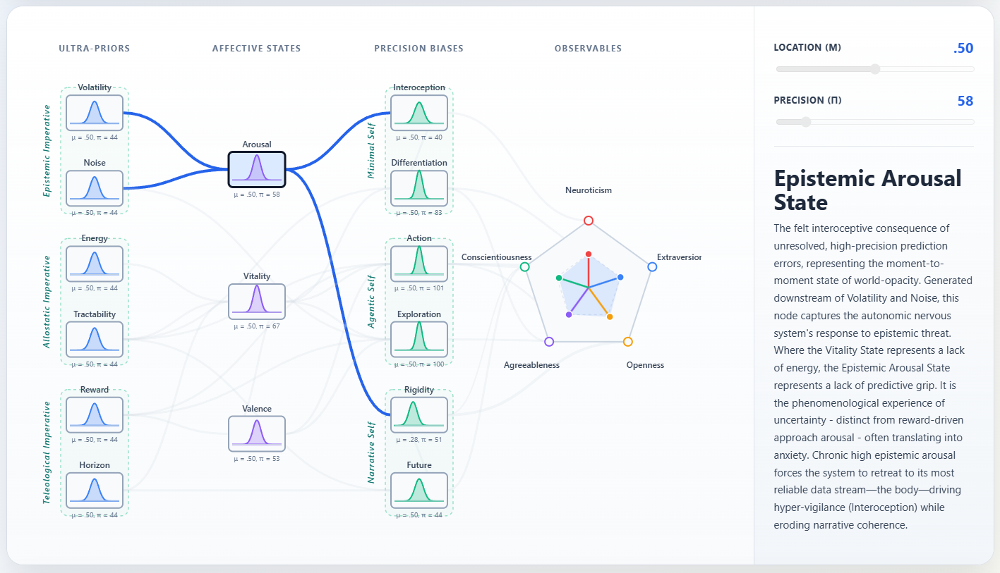

# Introduction
 
Personality psychology has achieved something genuinely remarkable: a near-complete consensus descriptive taxonomy of human individual differences. The Big-5 Model (Costa & McCrae, 1992; Goldberg, 1990) has proven robustly replicable across cultures, methods, and informants, accounting for a substantial proportion of variance in behaviour, health, and life outcomes (Roberts et al., 2007; Soto & John, 2017). Its hierarchical extension into the meta-traits of Plasticity and Stability (DeYoung, 2006) reveals that this variance is not merely structured, but organized in a way that hints at an underlying generative structure. At the level of psychopathology, the Hierarchical Taxonomy of Psychopathology (HiTOP; Kotov et al., 2017) has extended this approach into clinical science, demonstrating that many maladaptive traits and psychopathological symptoms can be grouped into the internalizing, externalizing, and thought disorder spectra, which form a coherent dimensional continuum with normal-range personality. Together, these frameworks represent the cumulative empirical achievement of trait science: they describe what personality looks like, with extraordinary reliability, across the full range of human behavioral variation. What they do not do, by design, is explain *why* personality coalesces that way.
 
The Big Five and HiTOP are explicitly constructed as descriptive systems, not causal ones. They specify the latent structure of trait covariance but remain largely agnostic about the generative processes that produce stable dispositions in the first place: why particular traits co-occur as they do, why the same underlying individual differences express themselves across psychopathological and non-clinical phenotypes, and why personality is so robustly heritable yet meaningfully shaped by experience. This mechanistic silence constitutes the central theoretical gap that the present framework addresses.
 
## The Limits of Existing Mechanistic Accounts
 
This gap has not gone unnoticed. Three broad traditions have attempted to ground personality in underlying mechanisms. The first is neurobiological: Eysenck (1967) anchored Extraversion and Neuroticism in cortical arousal and limbic reactivity; Gray (1981) reconceived these dimensions in terms of opponent motivational systems: the Behavioral Inhibition System (BIS), sensitive to punishment and uncertainty, and the Behavioral Approach System (BAS), sensitive to reward, with substantial neuroanatomical and pharmacological support; and Cloninger (1987) extended this into a biopsychosocial model distinguishing temperament (biologically grounded, early-emerging) from character (higher-order, self-reflective). These contributions were foundational: they shifted personality science from pure description toward biological instantiation and opened the door to testable predictions about pharmacological manipulation and neural correlates. Yet each framework remained relatively domain-local, anchored in a specific neural system (arousal, reinforcement, dopamine) without a unifying computational principle that scales across all levels of psychological organization.
 
The second tradition is cybernetic. DeYoung's Cybernetic Big Five Theory (CB5T; 2015), building on Powers' (1973) perceptual control theory, reconceptualizes personality as the characteristic parameters of a goal-directed, self-regulating system navigating uncertainty and reward. CB5T offers genuine mechanistic traction: Extraversion is reframed as reward-driven approach, Neuroticism as the chronic misalignment between expected and encountered outcomes, and the Plasticity/Stability meta-trait structure as reflecting the fundamental cybernetic tradeoff between exploration and regulation. This is conceptually the closest precursor to the present framework, and the present model is best understood as an attempt to formalize and deepen the CB5T intuition within a more principled computational architecture. However, CB5T remains primarily verbal: it does not specify the mathematical form of the control-system computations, the algorithmic structure of the hierarchy, or the mechanism by which regulatory failures cascade into psychopathology.
 
The third tradition is computational, and it is the most recent. Active inference models (Friston et al., 2017; Pezzulo et al., 2024) and hierarchical Bayesian accounts of perception and action (Clark, 2016; Hohwy, 2013) have begun to be applied to individual differences in cognition, emotion, and psychopathology (Badcock et al., 2017; Huys et al., 2016; Smith et al., 2021). Yet a systematic application of these formalisms to the full landscape of personality to cover not only cognitive style but affective temperament, motivational structure, self-model architecture, and their continuity with clinical psychopathology has not been attempted. Crucially, the existing computational accounts have largely been developed independently of the taxonomic personality literature, leaving the rich empirical structure of the Big-5 and HiTOP unexplained rather than subsumed.
 
A further problem compounds these theoretical divisions: the proliferation of partially overlapping constructs across frameworks has produced a landscape plagued by what Kelley (1927) termed the jingle-jangle fallacy: distinct labels applied to identical processes, and identical labels redefined across frameworks. Within personality science alone, the construct space around negative affect, threat sensitivity, behavioral inhibition, and Neuroticism represents a dense offering of nominally distinct but empirically overlapping measures (Bainbridge et al., 2022). This terminological fragmentation is not merely a nuisance; it actively impedes cumulative theoretical progress, because it is impossible to identify genuine convergence when the same underlying computation appears under different names in every framework. A mechanistic account that operates at the level of latent computational processes rather than surface-level trait labels offers a principled basis for resolving these ambiguities.
 
## The Free Energy Principle as a Unifying Framework
 
The framework we propose draws its computational foundation from the Free Energy Principle (FEP; Friston, 2010) and its action-oriented extension, active inference (Friston et al., 2017). The FEP holds that any self-organizing biological system (*i.e.,* any system that maintains its structural integrity against the entropic tendency toward disorder) must, implicitly or explicitly, act to minimize the divergence between its internal model of the world and the sensory observations it receives. This quantity, formalized as "variational free energy", serves as a tractable upper bound on surprise: a measure of how poorly a system's generative model accounts for its current sensory states. Minimizing free energy is equivalent to maintaining an accurate internal model of the world and, by extension, maintaining the organism's own organized existence.
 
In the active inference formulation, agents minimize free energy through two complementary strategies. *Perceptual inference* updates internal beliefs to better fit incoming sensory data, changing its model to fit the world. *Active inference* changes the world to fit the model: it generates actions that bring sensory states into correspondence with the predictions of the internal generative model. These two strategies are not alternatives but partners in a continuous cycle of self-organization. Their relative balance, determined by the *precision* (inverse variance) assigned to prior beliefs versus incoming prediction errors, is what determines whether an agent primarily accommodates to the world or asserts upon it.
 
Critically, this architecture is hierarchical. Biological brains implement generative models as deep hierarchies of predictive representations, where higher levels generate top-down predictions about lower-level activity, and lower levels propagate bottom-up prediction errors whenever observations deviate from these predictions (Friston, 2008; Rao & Ballard, 1999). Precision weighting (the selective amplification or attenuation of prediction errors at each level) is the unified mechanistic substrate of attention, confidence, and affective valuation. The FEP is therefore not merely a theory of perception or action, but a theory of the entire self-organizing agent: from the interoceptive signals that anchor bodily selfhood to the long-range policies that constitute deliberate goal pursuit.
 
What makes the FEP particularly powerful as a foundation for a personality theory is that it operates coherently across multiple timescales simultaneously. Fast timescale dynamics (moment-to-moment perceptual inference) are nested within slower dynamics (learning about environmental statistics), which are nested within slower dynamics still (updating the deep prior beliefs that constitute the enduring self). This nested temporal architecture maps naturally onto the structure of personality itself: traits are defined by precisely their cross-situational and longitudinal stability. They are patterns that persist across contexts because they are implemented as deep, slowly updating prior beliefs rather than as context-specific learned associations. On the FEP account, a trait is not a cause of behaviour; it is the computational signature of a stable configuration of prior expectations and precision weightings, whose downstream consequences we observe as consistent patterns of affect, cognition, and action.
 
This insight, that personality is best understood as *prior architecture* rather than as a set of fixed endowments, is the conceptual pivot of the present framework.
 
## Personality as a Free Energy Landscape
 
Under the FEP, an agent's generative model defines an implicit probability distribution over possible states of the world. This distribution has a geometry: some configurations of belief and policy correspond to regions of low expected free energy, *i.e.,* states the agent's model treats as coherent, predictable, and aligned with its own preferred outcomes, while others correspond to regions of high expected free energy, treated as uncertain, costly, or threatening. The agent's behaviour is not random within this geometry; it gravitates toward the low-free-energy configurations. In this sense, the trajectory of behaviour through state-space is analogous to the movement of celestial bodies under general relativity: just as gravity warps spacetime to dictate orbital geodesics, an agent's deep priors warp the free energy manifold, creating the path of least resistance that the system inevitably follows.

These low-free-energy configurations are the model's *attractor basins*. The depth of a basin (which also corresponds to the amount of perturbation the system can absorb before being dislodged from its habitual configuration) is determined by the precision assigned to the governing priors: high-precision priors create deep, rigid attractors that resist revision; low-precision priors create shallow, fluid ones that update readily under evidence. An agent's characteristic behavioural profile, its persistent ways of perceiving, feeling, and acting, corresponds not to some quantity the agent possesses but to the geometry of its free energy landscape: the location, depth, and connectivity of its attractor basins. A trait, in this dynamical account, is not something one *has*, it is a basin one falls into. By extension, personality profiles are the macro-level landscape topographies of those basins: a complex, idiosyncratic manifold of nested attractors governing the agent's trajectory.

 
This reformulation resolves several puzzles that the purely descriptive tradition leaves untouched, such as why traits display the co-occurrence structure they do. For instance, why does Neuroticism reliably correlate with emotional reactivity, cognitive rumination, and somatic vigilance simultaneously? Because all of these are downstream expressions of the same upstream prior configuration: a generative model that simultaneously expects the world to be volatile, the body to be under threat, and incoming information to be unreliable. Why do the Plasticity and Stability meta-traits partition the phenotypic space in the particular way they do? Because they reflect the fundamental computational tradeoff between exploration (actively seeking information to update the model) and regulation (maintaining the model's stability against perturbation), which is the same tradeoff that structures the FEP's treatment of expected information gain versus expected free energy reduction. Why do personality dimensions and psychopathological spectra share such substantial genetic and structural variance? Because both are attractors in the same landscape; psychopathology is not categorically different from personality but represents attractor configurations that are particularly costly, rigid, or maladaptive under typical environmental conditions.
 
# The Deep-Self Predictive Cascade Model
 
The present paper introduces the Deep-Self Predictive Cascade Model as a principled, formally specified realization of these principles. The model proposes that the free energy landscape of personality is generated by a structured computational hierarchy, in which parameter configurations at each level constrain and produce the states at the next. Formally, this hierarchy implements precision-weighted Bayesian message passing: each downstream state is the precision-normalized integration of its upstream inputs, directly instantiating belief propagation under predictive coding architecture (Friston, 2008).
 
The hierarchy cascades from foundational *Ultra-Priors* at the apex (deep prior expectations governing the agent's epistemic, allostatic, and teleological constitution) through emergent *Core Affective States* (Epistemic Arousal, Vitality, and Valence) that serve as precision-weighted summaries of upstream signals, into *Precision Biases* that govern attentional and volitional resource allocation across the Minimal, Agentic, and Narrative registers of self-organization, and finally into the observable *phenotypic profiles* that empirical taxonomy has catalogued as traits, spectra, and emotional types.
 
Crucially, the cascade is generative in the technical sense: the same upstream parameter configuration simultaneously and necessarily produces multiple downstream phenotypes, explaining their covariance not by positing a common cause *post hoc* but by deriving it from the computational structure of the hierarchy. This stands in contrast to factor-analytic models, where covariance is identified empirically and its source left open, and to neurobiological models, where covariance is attributed to shared substrate without specifying the computational process that links a given substrate to a phenotype.
 
Several theoretical commitments of this framework warrant explicit statements. First, the model is positioned at Marr's (1982) computational and algorithmic levels of analysis. It specifies what the system computes (minimization of variational free energy across a temporal hierarchy), the representations and processes used (hierarchical prior beliefs and precision-weighted message passing), and how these generate observable personality phenomena. At this stage, it remains largely agnostic about specific neural implementations, except where strong independent evidence supports specific claims. Second, the model does not compete with the Big-5 or HiTOP as descriptive systems; it provides a mechanistic explanation for the patterns those systems describe. The Big Five is not displaced but derived: its five factors emerge as the natural phenotypic attractors of the cascade, and their higher-order meta-trait structure (Plasticity and Stability) is explained by the fundamental computational architecture of the hierarchy rather than discovered *post hoc* in covariance data. Third, the hierarchy is not strictly unidirectional. Ultra-Priors are the slowest-updating level, constituted largely by genetic, developmental, and early experiential factors, but they are not immutable: sustained therapeutic, pharmacological, or transformative experiential interventions and catastrophic life events that generate sufficient precision-weighted prediction error at the highest levels of the hierarchy can lead to their update. The unidirectionality of the cascade is a description of moment-to-moment computational flow, not a claim about the impossibility of deep change.


Finally, the structure described below should not be taken as a biologically literal claim. We do not propose that exactly six Ultra-Priors exist as discrete neuronal populations, nor that their influence propagates through the cascade via identifiable point-to-point projections. Predictive coding architectures in biological brains are densely recurrent, with complex paths of mutual influence between any two nodes in the hierarchy; each parameter we describe almost certainly corresponds to a distributed population-level computation rather than a single identifiable substrate. Each "Ultra-Prior" is better understood as a functional attractor in a much larger underlying system of nested priors, and the three-level structure of the cascade is a minimum viable ontology: the smallest set of functional distinctions that, in combination, generates the observed covariance structure of personality with sufficient granularity to yield testable predictions. The number six reflects the orthogonal dimensions required to span the phenotypic space while maintaining computational and biological plausibility, not a claim about the brain's actual parameterization. Future neuroimaging and computational modeling work will be needed to determine whether these functional parameters map onto identifiable cortical hierarchies or emerge from more distributed dynamics.
 
The remainder of the paper proceeds as follows. We first describe the four levels of the cascade in detail, specifying the computational role of each node, its theoretical grounding in the existing literature, and its connectivity within the generative hierarchy. We then show how the cascade naturally generates the phenotypic profiles documented by the Big Five, Cybernetic Big Five Theory, Gray's BIS/BAS, Barrett's Constructed Emotion model, Primal World Beliefs, Panksepp's affective neuroscience, attachment theory, and the HiTOP dimensional taxonomy of psychopathology, subsuming these frameworks not by analogy but by derivation. We close by discussing the model's testable predictions, its implications for computational psychiatry and intervention science, and the empirical programme required to validate its core claims.


```{r}
#| fig-cap: "To support an easier engagement with the model's hierarchical structure and parameter interactions, an open-source interactive implementation of the Deep-Self Predictive Cascade Model is available at github.com/RealityBending/DeepSelfModel. The application allows users to manipulate individual Ultra-Prior parameters and observe the cascading consequences across affective states, precision biases, and phenotypic profiles in real time. This tool is intended both as a pedagogical resource and as a scaffold for hypothesis generation prior to formal computational modeling."
#| message: false
#| warning: false
#| apa-twocolumn: true
#| label: fig-one


```


## Ultra-Priors (The Deep Self)

Ultra-Priors constitute the agent's most fundamental and deeply entrenched probabilistic beliefs about its situation. They are called "ultra" to emphasise their position at the apex of the generative hierarchy: above the priors governing individual inferences, above the affective states those inferences generate, and above the moment-to-moment precision allocations that modulate attention and action. They form the computational bedrock of the system, the slow-moving constitutional layer that sets the ceiling and floor on what is achievable at every level below.

In formal active inference terms, Ultra-Priors correspond to the hyperparameters of the generative model: the parameters that govern the parameters governing the agent's predictions. They evolve on slow developmental timescales, are substantially heritable (consistent with the high heritability of broad personality dimensions; Bouchard & McGue, 2003; Vukasović & Bratko, 2015), and are shaped by early attachment experiences, cultural embedding, and cumulative learning history. Their effects are pervasive rather than domain-specific: a shift in any single Ultra-Prior propagates through the entire cascade, reconfiguring affective states, precision biases, and observable phenotypes simultaneously. This pervasive influence is what justifies their hierarchical apex position: they are not one set of parameters among others, but the constitutive conditions under which all other parameters operate.

Crucially, these priors do not exist in a vacuum; they govern a self-organising system that is formally delimited by a *Markov blanket*. This central concept refers to the statistical boundary that separates an agent's internal states from the external environment: it consists of the sensory states through which external causes impinge on the agent, and the active states through which the agent impinges on the environment. The blanket is not a physical membrane but a formal partition that defines what counts as "self" and "world" for a given system. Individual differences in how agents manage the permeability and coupling of this boundary (i.e., how open or closed they are to environmental influence, how strongly they couple their internal dynamics to those of other agents) are central to the personality differences this framework aims to explain.

Six Ultra-Priors are identified, organised along three Imperatives. The Epistemic Imperative governs the agent's foundational relationship with uncertainty. The Allostatic Imperative governs its foundational expectations about its own metabolic and efficacy resources. The Teleological Imperative governs its goal-directed orientation: the expected value of outcomes and the temporal depth across which it plans. Together, these three Imperatives cover the full space of what an agent must implicitly "believe" about its world, its body, and its future in order to operate as a self-organising system.


### The Epistemic Imperative

The Epistemic Imperative governs the agent's foundational relationship with uncertainty: its deep beliefs about the opacity of the world and the tractability of its own knowledge-generating processes. It is composed of two orthogonal parameters that dissociate the *dynamics* of uncertainty from its *baseline level*.

*Volatility Expectation* encodes the agent's prior belief about how rapidly the hidden causes of sensory observations change over time (i.e., the expected rate of environmental non-stationarity). This parameter corresponds directly to the ω (omega) hyperparameter of the Hierarchical Gaussian Filter (HGF; Mathys et al., 2011, 2014), a widely validated computational model of learning under uncertainty, whose recoverability from behavioural data provides a natural empirical route to measuring this prior. High ω implies that the agent expects environmental contingencies to fluctuate rapidly, with several cascading consequences: it attenuates confidence in previously learned associations (yielding a higher effective learning rate), keeps prediction error signals in a state of chronic partial unresolvability, and maintains the agent in a posture of readiness for model revision. This profile (chronically elevated learning rate combined with persistent uncertainty about whether the current model is adequate) constitutes the computational substrate of anxiety-related disposition: the world is expected to surprise, and those surprises are expected to reflect genuine structural change rather than incidental noise.

At the neurobiological level, Volatility Expectation is associated with noradrenergic signalling (Payzan-LeNestour et al., 2013), consistent with the known role of noradrenaline in adjusting the gain on prediction error signals and promoting environmental scanning under heightened uncertainty. High Volatility Expectation is the primary upstream driver of Epistemic Arousal (the Level 2 affective state detailed below), which in turn mediates its downstream effects on Internalizing psychopathology, the FEAR affective system, and anxious attachment.

*Noise Expectation* encodes the agent's belief about irreducible aleatoric uncertainty: the degree of ambiguity expected to persist *after* the agent has developed the best possible model of its environment. Where Volatility Expectation concerns uncertainty about the *structure* of the world (i.e., epistemic uncertainty that could in principle be resolved by better learning), Noise Expectation concerns uncertainty that is, by the agent's own reckoning, fundamentally irresolvable. This dissociation maps directly onto Yu and Dayan's (2005) influential distinction between *unexpected uncertainty* (signalled by noradrenaline, driving model updating) and *expected uncertainty* (signalled by tonic acetylcholine, enabling the agent to tolerate residual ambiguity without triggering full-scale model revision).

A high Noise Expectation functions as a permissive prior: the agent expects some irreducible ambiguity and, having already incorporated it into the generative model, does not interpret residual variance as evidence of catastrophic model failure. Low Noise Expectation produces the opposite configuration: the agent expects its world model to account for nearly all sensory variance, so residual uncertainty reads as a signal demanding correction. When that correction cannot be achieved, the mismatch triggers elevated arousal and aggressive precision reallocations, predisposing the agent toward premature epistemic closure, cognitive inflexibility, and heightened distress in response to ambiguous information. The pairing of low Noise Expectation with high Volatility Expectation is particularly destabilising: the agent both expects its model to be comprehensive and finds it perpetually outdated.

### The Allostatic Imperative

The Allostatic Imperative governs the agent's foundational expectations about its own metabolic and efficacy resources (its "body budget"; Barrett, 2017) and its capacity to act meaningfully upon the world. It dissociates two components that are often conflated in the broader literature: the expectation of *having* resources, and the expectation that those resources *can be used effectively*.

*Energy Expectation* encodes the agent's prior belief about the state of its allostatic reserve, i.e., whether the body budget is expected to operate at a surplus or a deficit. This parameter is grounded in Barrett's (2017) Constructed Emotion framework, which argues that the brain's primary interoceptive task is to regulate the metabolic economy of the body through predictive allostasis rather than reactive homeostasis: the brain maintains running predictions about the body's energy needs and pre-emptively allocates resources on the basis of those predictions.

The Energy Expectation Ultra-Prior represents the agent's long-run default prediction about this allostatic economy. An agent with high Energy Expectation approaches each moment presuming that metabolic resources are available for expenditure, generating a Vitality State that facilitates active coping, social engagement, and epistemic foraging. An agent with chronically low Energy Expectation presumes an imminent or ongoing deficit, generating a low Vitality State that suppresses action, social coupling, and exploration in favour of conservation. Chronic low Energy Expectation, interacting with the other Ultra-Priors in a manner detailed below, constitutes the computational substrate of depressive states and burnout, not as acute mood disturbances but as stable attractor configurations driven by a fundamental prior expectation of metabolic insufficiency.

*Tractability Expectation* encodes the agent's prior belief that its own actions can reliably reduce prediction error: the sense that the world is amenable to influence. This corresponds to what psychological language variously calls perceived controllability, self-efficacy (Bandura, 1977), or, in FEP lexicon, the expected precision of proprioceptive signals and the expected sensitivity of environmental outcomes to policy execution (Friston et al., 2011; Adams et al., 2013).

This parameter governs not only the pragmatic dimension of policy selection (high Tractability supporting approach behaviour, active coping, and environmental engagement) but also the structural coupling of the agent's Markov blanket to the social environment. Because ineffective actions waste metabolic resources, low Tractability creates dual pressure: it suppresses action (via the Vitality State and Action-Perception Bias) and simultaneously discourages social engagement (via the Differentiation-Dissolution Bias). The interaction of these effects generates the anxious-avoidant structure of attachment insecurity, the Internalizing-Externalizing bifurcation in psychopathology, and the Stability meta-trait in personality. Conversely, Tractability is the primary upstream determinant of secure attachment and existential transcendence, i.e., the capacity to extend one's generative model beyond the lifespan through cultural, biological, or structural legacy.

### The Teleological Imperative

The Teleological Imperative governs the agent's goal-directed orientation: its fundamental expectations about the value of available outcomes and the temporal depth across which it plans. It is composed of two parameters that independently determine the *magnitude* and *temporal scope* of motivational engagement, though the interaction between them is where the most consequential personality configurations emerge.

*Reward Expectation* encodes the agent's baseline sensitivity to goal-attainment signals and the expected value of available outcomes (i.e., the prior probability distribution over preferred states). In the formal active inference framework, this corresponds to the log prior over preferred observations, the **C**-vector in Friston's (2016) formulation, which weights the expected free energy of a policy by the degree to which it leads the agent toward intrinsically valued states.

Crucially, Reward Expectation is not identical to experienced hedonic pleasure, nor is it synonymous with Tractability. An agent can hold a high expectation that actions are effective (high Tractability) while simultaneously expecting available outcomes to be low in value (low Reward Expectation), yielding a configuration of competent apathy: the capacity for action without motivational engagement. Conversely, high Reward Expectation with low Tractability yields frustrated approach drive: the agent is drawn toward valued outcomes it cannot reliably attain, a profile with clear relevance to approach-motivated depression (Trew, 2011) and the specific suffering of the high-BAS/low-efficacy presentation.

At the neurobiological level, Reward Expectation maps onto mesolimbic dopaminergic circuitry, specifically the tonic dopamine signalling that encodes prior expectations about reward availability (Schultz et al., 1997). Within the cascade, high Reward Expectation simultaneously amplifies approach behaviour (via the Action-Perception Bias), promotes exploratory foraging (via the Exploration-Exploitation Bias), and elevates hedonic tone (via the Valence State). This triple action makes it the primary upstream anchor of the Behavioral Approach System (BAS), Sensation Seeking, and the Primal World Belief that the world is *enticing*.

*Horizon Expectation* encodes the agent's prior belief about the temporal depth of its policy space (i.e., how far into the future the generative model actively extends its predictions and plans). In formal active inference tree-search frameworks (Friston et al., 2017), this corresponds to the parameter *T*, the maximum look-ahead depth of the policy evaluation procedure. It is, in an important sense, the most distinctively existential of the Ultra-Priors: it encodes how the agent implicitly resolves the ultimate prediction error of its own eventual termination.

The Horizon parameter interacts with Reward Expectation to produce a characteristic two-dimensional motivational space. An agent with high Reward Expectation and low Horizon operates as an active present-hedonic system: highly motivated, attuned to immediate reward, but disengaged from longer-range consequences (the computational signature of impulsivity and sensation seeking). An agent with high Reward Expectation and high Horizon is the ambitious, legacy-oriented profile: motivated by high expected value and capable of deferring gratification across extended temporal windows. An agent with low Reward Expectation and high Horizon represents a stoic, duty-driven configuration: capable of long-range planning but not animated by anticipated pleasure, planning out of structure or obligation rather than desire. Low Reward Expectation combined with low Horizon yields a truncated, disengaged motivational profile (the territory of nihilistic withdrawal). This truncation is not necessarily pathological; in some contexts it is an adaptive response to genuine uncontrollability.

At its extreme low end, a truncated Horizon represents a self-model contracted to the immediate term, either because the future is expected to be too uncertain to be worth modelling (related to high Volatility Expectation) or because the agent has adopted strategic disengagement to avoid the enormous free energy cost of a future it cannot control. When chronic, this configuration corresponds to the nihilistic disengagement observable in existential depression and certain presentations of personality disorder, marking a collapse of both narrative coherence and existential purpose. At its high end, a deep Horizon represents a self-model extended across time through legacy, cultural production, biological reproduction, or ideological commitment, i.e., the phenomenological signature of transcendence: the agent that resolves the prediction error of mortality by embedding its generative model in structures that outlast its physical boundaries. Horizon Expectation is accordingly the primary driver of the Existential Transcendence phenotype and a strong upstream determinant of Conscientiousness through its structuring influence on the Future-Present Bias described below.


## Core Affective States

Core Affective States represent the first level of integration across the Ultra-Prior configuration: the phenomenological signal that the agent's deep computational constitution generates as it engages with the world. Importantly, these states are not reactive outputs of discrete emotional circuits. On the model's account, they are continuously generated predictions: the agent's ongoing forecast of its own affective condition, updated in light of how closely the world conforms to its deep prior expectations. They are, in the language of predictive processing, interoceptive predictions rather than interoceptive readouts.

We describe three affective dimensions that dissociate the phenomenological quality of affective experience more precisely than the standard two-dimensional valence-arousal circumplex (Russell, 1980), while remaining computationally grounded. Each dimension has distinct upstream drivers and serves distinct downstream functions within the cascade.

*Epistemic Arousal* is the interoceptively registered consequence of unresolved, high-precision prediction errors, i.e., the phenomenological experience of world-opacity. Generated downstream of both Volatility Expectation and Noise Expectation, it captures the autonomic nervous system's response to epistemic threat: the heightened physiological preparation that occurs when the environment is generating surprises that the current generative model cannot adequately absorb.

Epistemic Arousal is phenomenologically distinct from reward-anticipatory arousal (BAS-type arousal), i.e., the physiological activation generated by the anticipation of valued outcomes. Where incentive arousal covaries with positive Valence and drives approach behaviour, Epistemic Arousal is generated by the anticipation of prediction error: the sense that the world is behaving in ways the generative model has not anticipated and cannot yet resolve. This distinction is computationally important: high Epistemic Arousal without high Valence corresponds to anxiety; high Valence with moderate Arousal corresponds to excitement. Dissociating these two dimensions from a shared generic "arousal" construct is one of the theoretically significant contributions of this level's architecture, and it generates a specific empirical prediction: measures of interoceptive prediction error sensitivity should load independently of measures of reward anticipation on psychophysiological tasks, even when both produce elevated autonomic arousal.

Chronically elevated Epistemic Arousal forces the agent to retreat to its most reliable internal data stream (i.e., interoceptive signals from the body), thereby driving the Interoception-Exteroception Bias toward the somatic pole and eroding narrative coherence. This cascade predicts the empirically observed association between trait anxiety, interoceptive sensitivity, and narrative identity disruption (see below).

*Vitality State* is the phenomenological correlate of the agent's allostatic reserve: what agents experience as energy, drive, and engagement at the high end, and as fatigue, depletion, and burnout at the low end. Generated downstream of Energy Expectation, Tractability Expectation, and Horizon Expectation, it integrates allostatic, efficacy, and temporal signals into a single scalar representation of the agent's capacity to engage with its environment. High Vitality signals an expected surplus: the agent is well-provisioned, its actions are anticipated to be effective, and its future is sufficiently modellable to warrant investment. Low Vitality reflects the contrary: an expected or actual allostatic deficit that triggers a suite of conservative responses, including reduced action, social withdrawal, and suppressed epistemic foraging.

The Vitality State is the principal mediator between the allostatic Ultra-Priors and the Differentiation-Dissolution Bias described in the next section. High Vitality supports social engagement and structural coupling with others (the Dissolution pole), while low Vitality triggers withdrawal and boundary reinforcement (the Differentiation pole). This mechanism generates a specific prediction about attachment behaviour: allostatic load should predict avoidant attachment strategies independently of epistemic threat, a prediction that existing attachment research has not explicitly tested but that is consistent with the empirical literature on illness, chronic fatigue, and depression-linked social withdrawal.

*Valence State* is the phenomenological correlate of the agent's hedonic tone and anticipatory positive affect. It corresponds to the agent's real-time tracking of its trajectory through the free energy landscape: a system moving toward preferred states (i.e., one for which prediction errors are being progressively resolved) generates positive Valence, while a system moving away from preferred states, or one for which preferred states appear increasingly inaccessible, generates negative Valence. Valence thus encodes not the absolute distance from a preferred state but the direction and rate of change toward or away from it, making it sensitive to momentum and trajectory rather than static position.

Valence receives direct input from Reward Expectation (higher prior sensitivity to reward generates higher baseline hedonic tone) and an inverse modulatory signal from Vitality State (energetic depletion blunts positive affect, even when preferred outcomes remain nominally available). This interaction generates the theoretical possibility of approach-motivated low mood: an agent with high Reward Expectation but low Vitality that remains drawn toward valued outcomes it lacks the metabolic capacity to pursue. This configuration maps closely onto the clinical profile of agitated depression and may help explain the heterogeneity of depressive presentations, in particular why some depressed individuals experience prominent anhedonia (low Reward Expectation driving low baseline Valence) while others present with preserved or even heightened goal-directedness alongside severe functional impairment (high Reward Expectation with depleted Vitality).

## Precision Biases (The Self)
 
The third level of the cascade represents the precision allocation machinery of the active inference agent: the dispositional parameters that determine, moment-to-moment and across situations, how much weight the system places on different information sources, action strategies, and temporal frames. Within the FEP framework, precision weighting is the mechanism by which beliefs are selectively amplified into attention and action. It is not a peripheral process but a core computational operation: the agent that assigns high precision to a signal treats it as reliable evidence; the agent that assigns low precision treats it as noise. Stable individual differences in these allocations are what observers classify as personality.
 
These biases are called "self" biases because they correspond to the three canonical layers of phenomenological self-organisation identified in both cognitive neuroscience and the philosophy of mind, now given explicit computational content by the cascade. The Minimal Self governs the agent's sensory and somatic boundary with the world. The Agentic Self governs its epistemic and volitional engagement with the world. The Narrative Self governs its temporal continuity and autobiographical coherence. Together these three registers span the full architecture of selfhood: how the agent is in the world, who it is as an acting subject, and what it projects itself to be across time.
 
It is worth noting that these three self-registers map preferentially onto the three Imperatives at the top of the hierarchy: the Minimal Self is primarily shaped by the Epistemic Imperative, the Agentic Self by the Allostatic and Teleological Imperatives, and the Narrative Self by the Teleological Imperative. This cross-level structural coherence is not incidental. It reflects the model's underlying claim that the full architecture of the self, from its most primitive sensory boundary to its most elaborated temporal self-projection, can be derived from three fundamental questions every self-organising agent must implicitly answer. Echoing Kant's fundamental triad (*Critique of Pure Reason*), these are: what can I know? what can I control? and what should I seek? Or, in more existentialist terms: how to read the world, how to wield the body, and what to value across time.
 
### The Minimal Self: Interoceptive and Boundary Biases
 
The Minimal Self represents the most fundamental layer of self-organisation: the topological parameters of the Markov blanket that delineates the agent from its environment. It is linked to Metzinger's (2003) Minimal Phenomenal Self, Damasio's (1999) Proto-Self, and the interoceptive inference framework of Seth (2013, 2021). Its two biases govern where the agent's primary self-regulatory anchor is located (interoception vs. exteroception) and how permeable its boundary with the world is (differentiation vs. dissolution).
 
The *Interoception-Exteroception Bias* governs the relative weight the self-model places on internal bodily signals versus external sensory structure for the purposes of self-regulation and prediction error resolution. When the body is the primary anchor, driven by chronically elevated Epistemic Arousal, the agent monitors its own somatic state with high precision, amplifying the consequences of physiological disturbances and privileging interoceptive signals in the construction of emotional experience. This configuration corresponds to the Neuroticism phenotype: a stable attractor in which trait anxiety is sustained not by the world's objective unpredictability but by the agent's tendency to use its own aroused somatic state as the primary evidence about the world's safety.
 
High interoceptive bias also suppresses structural coupling with other agents: when the body is the primary regulatory anchor, the agent invests less in establishing synchrony with others or in using environmental structure for prediction. This suppression is the mechanism by which chronic anxiety generates social withdrawal, not through deliberate avoidance but through the implicit reallocation of precision toward the interoceptive channel.
 
At the neurobiological level, interoceptive precision weighting is associated with insular cortex activity, anterior cingulate cortex function, and the high-low vagal tone continuum, consistent with the extensive literature linking these structures to both trait anxiety and interoceptive awareness (Critchley & Garfinkel, 2017).
 
The *Differentiation-Dissolution Bias* governs the structural coupling of the agent's Markov blanket to other agents and to the environment more broadly. The Differentiation pole favours the maintenance of clearly bounded, autonomous self-models; the Dissolution pole favours intense synchrony with other agents and the environment, reducing the information-theoretic boundary between self and other.
 
This bias receives converging inputs from the Vitality State (energetic surplus enables social engagement while deficit forces withdrawal) and from Tractability Expectation (an agent that expects its actions to be effective can afford to couple closely with others; an agent that expects futility will withdraw to preserve internal integrity). The interaction of these two inputs generates the empirically observed anxious-avoidant structure of attachment insecurity: high Epistemic Arousal combined with adequate Tractability produces anxious over-coupling, as the agent seeks synchrony to resolve uncertainty; low Vitality combined with low Tractability produces avoidant withdrawal, as the agent retreats to preserve limited resources.
 
The Differentiation-Dissolution Bias is the primary upstream driver of Extraversion and Agreeableness in the Big Five, of the Externalizing spectrum in HiTOP, and of all three attachment pattern phenotypes. It also determines the expression of Panksepp's PANIC/GRIEF system: separation distress is, on this account, the phenomenological signature of an abrupt, involuntary shift toward the extreme Differentiation pole, resulting in the loss of synchrony with a partner whose Markov blanket had been partially incorporated into the agent's own self-model.
 
### The Agentic Self: Epistemic and Volitional Biases
 
The Agentic Self represents the epistemic and volitional dimension of the self-model: the system that actively controls its own knowledge-gathering and world-changing processes. It corresponds to Metzinger's (2003) Epistemic Agent Model, the active inference framework for understanding how agents select among exploration and exploitation policies (Friston et al., 2015; Pezzulo et al., 2015), and DeYoung's (2015) cybernetic analysis of the Plasticity meta-trait as a system for managing uncertainty.
 
The *Action-Perception Bias* governs the relative weight the agent places on changing the world versus changing its beliefs about the world as the primary mode of prediction error resolution. An action-heavy parameterisation (i.e., high precision on proprioceptive signals and motor commands) generates a system that resolves uncertainty by acting upon the environment: approach drive, assertiveness, and rapid behavioural engagement. A perception-heavy parameterisation generates a system that resolves uncertainty by internal belief updating: reflection, accommodation, and conceptual revision.
 
This bias is shaped by two convergent upstream inputs. Tractability Expectation amplifies action, since an agent that expects its actions to be effective naturally prefers action as a resolution strategy. Reward Expectation amplifies action as well, because high-value outcomes motivate approach. However, the bias stands in a structural trade-off with the Exploration-Exploitation Bias: the same attentional and metabolic resources allocated to active environmental control cannot simultaneously be allocated to exploratory information-gathering. This trade-off generates a specific prediction that is consistent with the empirically observed small negative correlation between Conscientiousness and Openness to Experience: a generative account in which that correlation reflects a precision allocation constraint rather than two independently varying trait dimensions.
 
The *Exploration-Exploitation Bias* governs the relative weight the agent places on epistemic policies, i.e., those that yield high information gain, versus pragmatic policies that exploit known priors to secure preferred outcomes. In the active inference formalism, this corresponds to the expected epistemic value of sampling under uncertainty (Friston et al., 2015), a construct closely related to curiosity (Kidd & Hayden, 2015; Parr & Friston, 2017).
 
Importantly, this bias may be more precisely understood as two qualitatively distinct sub-dimensions that share a common upstream driver but diverge in their target domain. *Somatic Exploration* is epistemic foraging directed at the physical Markov blanket, translating into risk-taking, high-intensity sensory experience, and somatic edge-testing. This sub-dimension is the primary driver of Sensation Seeking and shares variance with the action pole of the Action-Perception Bias. Its logic can be understood as a graded programme of injecting prediction errors into the physical system to confirm the existence and resilience of the minimal bodily self. At its mild end, somatic exploration characterizes voluntary perturbations of bodily sensing through exercise, breathwork, or cold exposure. At its extreme, it encompasses visceral threat-seeking such as high-consequence physical risk, where the unambiguous certainty of intense somatic sensation functions to ground and reconfirm the self-model against diffuse epistemic uncertainty. This graded structure also explains why somatic exploration is elevated in individuals with chronically high Epistemic Arousal: when the narrative self is unstable, the body offers the most precision-certain available self-confirmation. *Phenomenological Exploration* is epistemic foraging directed at the conceptual and narrative boundaries of the self-model, translating for instance into appetite for creative experimentation, transgressive art, esoteric philosophy, and at its extreme altered states of consciousness induction (e.g., through psychedelic experiences). This sub-dimension is the primary driver of Openness to Experience, particularly its Intellect and Openness-proper facets.
 
 
Both sub-dimensions are suppressed by Vitality deficit (foraging is metabolically costly and is curtailed under allostatic load), elevated by high Noise Expectation (an agent that can tolerate irreducible ambiguity finds exploration rewarding rather than threatening), and strongly driven by Reward Expectation (reward-relevant information carries both pragmatic and epistemic value). This multi-input structure generates a specific prediction: the correlation between Reward Expectation and Exploration should be moderated by Vitality State, such that reward sensitivity translates into active foraging only when metabolic resources are available.
 
### The Narrative Self: Temporal and Coherence Biases
 
The Narrative Self represents the diachronic dimension of self-organisation: the self that persists across time, integrates experiences into a coherent autobiography, and projects itself into an anticipated future. It corresponds to McAdams' (1993, 2001) Narrative Identity theory and Metzinger's (2003) Autobiographical Self-Model, and is sustained by the binding operations of the hippocampal-default mode network system. Crucially, the Narrative Self is a hierarchically higher-order structure: it requires a functioning, stable synchronic substrate (i.e., a coherent Minimal and Agentic Self) before it can construct and maintain diachronic continuity. This hierarchical dependence generates a specific empirical prediction: disruptions to the Minimal Self, such as those arising from severe interoceptive dysregulation, should impair narrative coherence even when the explicit narrative-processing system is structurally intact.
 
The *Rigidity-Fluidity Bias* governs the weight assigned to autobiographical continuity and the stability of the narrative self-model, i.e., the degree to which the agent treats its past self-model as a high-precision prior on its current and future self. At the Rigidity pole, the narrative self is assigned high precision: past identity configurations carry great weight, the self-model is resistant to revision, and the agent experiences a strong sense of continuous personal identity across time and contexts. This translates dispositionally into conservatism, deliberateness, and, in adaptive forms, the stable goal-directedness that underlies Conscientiousness.
 
At the Fluidity pole, the narrative self is assigned low precision: the self-model updates readily in response to new information, allowing for flexible self-revision but also creating vulnerability to identity fragmentation under conditions of high Epistemic Arousal. This vulnerability is the computational mechanism underlying the positive relationship between trait Openness and susceptibility to psychosis-spectrum experiences (Mason et al., 2005), a relationship that has been empirically documented but not previously explained at the level of generative process.
 
Clinical evidence also suggests a U-shaped relationship between Epistemic Arousal and Rigidity in some individuals, who respond to elevated uncertainty with defensive rigidification rather than increased fluidity. This can be interpreted as a compensatory precision re-allocation in which threat amplifies rather than attenuates narrative prior precision, functioning as a structural defence against fragmentation. This inverted response constitutes a clinically important individual difference: it predicts that some individuals will respond to threat with increased rigidity of self-narrative, manifesting as dogmatism, black-and-white thinking, or identity foreclosure, while others will show the more typical fluidity response. Future empirical work should test whether this difference is itself a stable prior parameter or a situationally induced precision shift.
 
The *Future-Present Bias* governs the temporal discounting of predicted outcomes, specifically the rate at which the precision assigned to a predicted consequence degrades as a function of its temporal distance. A high Future Bias (low discounting) means that the agent weights distal consequences almost as heavily as proximate ones, enabling the deliberate, goal-directed, delayed-gratification behaviour that observers rate as Conscientiousness. A high Present Bias (high discounting) means that the agent's decision-relevant representations are dominated by immediately available evidence, yielding highly reactive, context-sensitive, impulsive behaviour profiles.
 
The Future-Present Bias is constrained from above by Horizon Expectation (policy depth cannot exceed the temporal boundary set by the Horizon Prior) and is shaped by Tractability Expectation (an agent that expects its actions to be ineffective has little incentive to plan far ahead, since long-horizon plans that cannot be executed generate free energy without resolving it). This dual constraint generates a specific and testable prediction: Tractability should moderate the translation of Horizon into Future Bias, such that a deep temporal horizon only produces genuinely Conscientiousness-like behaviour when the agent also expects its actions to be effective. High Horizon combined with low Tractability should instead produce ruminative future-orientation without goal-directed follow-through, a pattern consistent with the anxious perfectionism cluster seen in certain presentations of obsessive-compulsive spectrum disorders.
 
## Observable Personality Phenotypes
 
The final level of the cascade represents the "Observables": the terminal, macro-level behavioral and experiential patterns that reliably emerge from the dynamic interactions of the upstream parameters. In the context of our model, personality phenotypes are not discrete entities but the stable, downstream attractor states generated by a specific configuration of Ultra-Priors, Core Affective States, and Precision Biases. Crucially, these phenotypes correspond to the constructs typically targeted by traditional psychometric instruments, such as self-report questionnaires, clinical interviews, and behavioral assessments. While we acknowledge that some modern psychometric tools attempt to directly capture higher-order latent parameters, and conversely, that some deep computational phenotypes remain notoriously difficult to measure, this level essentially groups the "outcome variables" of the descriptive level at which the majority of historical personality psychology and clinical taxonomy has operated. By situating these familiar trait taxonomies here, at the base of the predictive cascade, we do not invalidate them; rather, we provide them with the mechanistic, generative foundation they have historically lacked. The specific mappings between the generative parameters of the Deep-Self Model and the observable phenotypes of established taxonomies will be detailed next.


# Relationship with Existing Frameworks and Constructs


The preceding four sections described the Deep-Self Predictive Cascade Model in its native computational vocabulary: six Ultra-Priors, three Core Affective States, six Precision Biases, and their formal relationships. The present section presents a systematic derivation of the major empirical frameworks in personality psychology, affective neuroscience, and clinical science from the cascade's parameter space. Rather than an exercise in post-hoc analogy, we propose that each framework addressed here captures a bounded subset of the causal structure that the cascade formalizes more completely. The empirical regularities each framework describes are not merely consistent with the model but, in a precise technical sense, generated by it as necessary downstream consequences of particular cascade configurations. Where a framework's primary constructs correspond directly to cascade parameters, we identify it as a candidate empirical validation anchor for those parameters. Additionally, we try to leverage our model to identify the additional predictions the cascade generates that the framework, operating within its own conceptual vocabulary, cannot produce.

<!-- **Table 1.** *Mapping of major existing frameworks onto Deep-Self Predictive Cascade Model levels. Ultra-Prior columns indicate the primary upstream drivers; (+) indicates a positive correspondence, (-) indicates an inverse relationship. Precision Bias abbreviations: Int = Interoception-Exteroception; Diff = Differentiation-Dissolution; Act = Action-Perception; Exp = Exploration-Exploitation; Rig = Rigidity-Fluidity; Fut = Future-Present.* -->

<!-- | Framework / Construct | Primary Ultra-Priors | Core Affective States | Primary Precision Biases | -->
<!-- |---|---|---|---| -->
<!-- | Neuroticism | Volatility (+), Noise (–) | Epistemic Arousal (+) | Interoception (+) | -->
<!-- | Extraversion | Reward (+), Tractability (+) | Valence (+), Vitality (+) | Dissolution (+), Action (+) | -->
<!-- | Openness to Experience | Noise (+), Reward (+) | Vitality (+) | Exploration (+), Rigidity (–) | -->
<!-- | Agreeableness | Tractability (+), Energy (+) | Vitality (+) | Dissolution (+) | -->
<!-- | Conscientiousness | Tractability (+), Horizon (+) | Vitality (+) | Future (+), Rigidity (+), Action (+) | -->
<!-- | Plasticity meta-trait | Reward (+) | Valence (+), Vitality (+) | Action (+), Exploration (+) | -->
<!-- | Stability meta-trait | Tractability (+), Horizon (+) | Vitality (+) | Rigidity (+), Future (+), Interoception (–) | -->
<!-- | BIS (Gray) | Volatility (+), Noise (–) | Epistemic Arousal (+) | Interoception (+), Action (–) | -->
<!-- | BAS (Gray) | Reward (+) | Valence (+) | Action (+), Exploration (+) | -->
<!-- | Sensation Seeking | Reward (+) | Valence (+), Vitality (+) | Action (+), Exploration-Somatic (+) | -->
<!-- | Internalizing (HiTOP) | Volatility (+), Energy (–), Tractability (–) | Arousal (+), Vitality (–) | Interoception (+) | -->
<!-- | Externalizing (HiTOP) | Reward (+), Horizon (–) | Valence (+), Vitality (+) | Action (+), Dissolution (+), Rigidity (–) | -->
<!-- | Thought Disorder (HiTOP) | Volatility (+), Noise (–) | Epistemic Arousal (+) | Rigidity (–) | -->
<!-- | Detachment (HiTOP) | Reward (–) | Valence (–) | Differentiation (+) | -->
<!-- | Secure attachment | Tractability (+), Volatility (moderate) | Vitality (+) | Dissolution (stable) | -->
<!-- | Anxious-preoccupied attachment | Volatility (+), Tractability (moderate+) | Epistemic Arousal (+) | Dissolution (+), Interoception (+) | -->
<!-- | Avoidant-dismissing attachment | Energy (–), Tractability (–) | Vitality (–) | Differentiation (+) | -->
<!-- | Fearful-avoidant attachment | Volatility (+), Tractability (–) | Arousal (+), Vitality (–) | Unstable across all | -->
<!-- | SEEKING (Panksepp) | Reward (+), Energy (+) | Valence (+), Vitality (+) | Exploration (+), Action (+) | -->
<!-- | FEAR (Panksepp) | Volatility (+), Noise (–) | Epistemic Arousal (+) | Interoception (+), Differentiation (+) | -->
<!-- | PANIC/GRIEF (Panksepp) | — | Vitality (–) | Differentiation (forced +) | -->
<!-- | Safe primal | Tractability (+), Noise (+) | — | — | -->
<!-- | Enticing primal | Reward (+) | Valence (+) | — | -->
<!-- | Alive primal | — | — | Dissolution (+) | -->
<!-- | Ego dissolution (REBUS) | All (precision relaxed) | All | All (precision relaxed) | -->

<!-- TODO: do we want this table or is it unnecessary? Perhaps we could represent that in a figure? -->


## Trait and Dimensional Taxonomies

### The Big-5

Being some of the most robust and reliably measureable features of Human personality, the Big-5 factors are prime observable-level targets for our model. However, it is worth noting that the cascade model does not predict, from first principles, that personality variance must partition into exactly five orthogonal dimensions. What it derives is the *pattern of covariance* among observable behavioral dispositions, and the empirical finding that this structure is well approximated by five broad factors follows as a tractable dimensionality reduction of the cascade's more continuous output space. Each factor corresponds to a stable attractor configuration that is generated by a coherent upstream parameter combination rather than a single isolated cause.

*Neuroticism* emerges from the path Volatility Expectation (positive) combined with low Noise Expectation, propagating into chronic Epistemic Arousal, and downstream into the Interoception-Exteroception Bias. The cascade locates the origin of trait anxiety not in the affective system per se but in the upstream prior configuration of a world expected to change rapidly and to yield no tolerable residual ambiguity: a combination that generates persistent prediction error that cannot be absorbed or resolved. Neuroticism's diverse facet structure, spanning anxiety, depression-proneness, irritability, and self-consciousness, reflects the further downstream bifurcation of this Arousal signal: anxiety facets reflect the Arousal pathway into somatic Interoception; depression-prone facets reflect the Arousal pathway into narrative Rigidity suppression (the inability to maintain a stable self-narrative under epistemic load); irritability reflects the interaction of high Arousal with a retained Action Bias (approach activation under conditions of uncertainty generates frustrated-approach affect rather than clean withdrawal); and self-consciousness reflects the Interoception pathway's suppression of social Dissolution coupling (when the body is the primary regulatory anchor, investment in social synchrony is deprioritized).

*Extraversion* emerges from the path Reward Expectation and Tractability converging on Valence and Vitality, and downstream into the Dissolution pole of the Differentiation-Dissolution Bias combined with the Action pole of the Action-Perception Bias. The cascade explains Extraversion's trans-domain facet structure (social engagement, positive affect, assertiveness, activity level) as the convergent expression of two distinct computational streams: the social synchrony stream via Dissolution and the approach drive stream via Action Bias. These share common upstream drivers and therefore co-occur reliably without being computationally identical. This generates a testable dissociation: individuals with high Reward Expectation but low Vitality (for instance, under allostatic depletion) should retain elevated Action Bias while Dissolution is suppressed, producing a socially withdrawn but internally motivated profile that standard Extraversion questionnaires would misclassify.

*Openness to Experience* emerges from the path of high Noise Expectation combined with adequate Reward Expectation, feeding into the Phenomenological sub-dimension of the Exploration-Exploitation Bias, together with low Rigidity. High Noise Expectation provides the permissive buffer that makes conceptual exploration non-threatening: an agent that has already incorporated irreducible ambiguity into its generative model can pursue novel information without treating conceptual disruption as evidence of model failure. Low Rigidity provides the complementary parameter: a fluid self-model accommodates challenging new information by updating rather than defending. The cascade predicts that Openness's Intellect and Openness-proper facets (DeYoung et al., 2007) reflect the differential contribution of Phenomenological Exploration, driven by ambiguity tolerance, versus Somatic Exploration, driven by Reward Expectation, a prediction that is directly testable through differential prediction by acetylcholinergic versus dopaminergic psychophysiological markers.

*Agreeableness* emerges from the path Tractability and Vitality, converging on the Dissolution pole without the Action Bias amplification that characterizes Extraversion. Agreeableness represents cooperative coupling: sustained investment in social synchrony that does not require high approach drive or pronounced positive affect as its proximate motivation. Because Agreeableness and Extraversion share the Dissolution pathway while diverging on the Action Bias, the cascade predicts a moderate positive genetic correlation between the two factors, consistent with the empirical literature, while also predicting that allostatic depletion should suppress Agreeableness more readily than Extraversion, as Vitality governs Dissolution directly while Extraversion receives additional upstream support through the Reward-Valence pathway that is more metabolically independent.

*Conscientiousness* emerges from the path Tractability combined with deep Horizon Expectation, propagating into Future-Present Bias, narrative Rigidity, and effective policy execution via the Action Bias. The cascade predicts that Conscientiousness decomposes into at least two computationally distinct sub-components: an orderliness component (driven by narrative Rigidity, the maintenance of a stable, consistent self-model across time) and an industriousness component (driven by Tractability combined with Future Bias, effective action organized around long-range goals). These sub-components should show dissociable sensitivity to allostatic load: narrative-based orderliness, being a precision weight on autobiographical priors, should be more susceptible to acute pharmacological and situational disruption, while industriousness should be more resistant to acute perturbation and more sensitive to chronic changes in perceived efficacy.

The cascade's derivation of five broad factors does not preclude the possibility of a sixth. The HEXACO model (Ashton & Lee, 2007) identifies *Honesty-Humility* as a dimension capturing individual differences in sincerity, fairness, and resistance to exploiting others for personal gain, which loads negatively on psychopathy-spectrum traits and positively on prosocial restraint. Within the cascade, Honesty-Humility corresponds to a specific configuration of the Differentiation-Dissolution Bias in interaction with Tractability: an agent with high Tractability (confident in its own efficacy) that nonetheless maintains a high Dissolution coupling to others will experience the exploitation of those others as a self-model violation rather than an opportunity, because defection generates prediction errors against the agent's own preferred relational states. In contrast, low Dissolution combined with high Tractability generates the exploitative configuration characteristic of low Honesty-Humility. This derivation predicts that Honesty-Humility should share genetic variance with Agreeableness (both require high Dissolution) while diverging on the Tractability dimension: Agreeableness reflects cooperative coupling under adequate efficacy, while Honesty-Humility specifically reflects the restraint of exploitation capacity. Whether this warrants a sixth independent factor or constitutes a facet configuration of existing cascade parameters is an empirical question that the model leaves open.

### Psychopathology

The Hierarchical Taxonomy of Psychopathology (HiTOP, Kotov et al., 2017) model constitutes the natural extension of trait-taxonomic science into the clinical range, demonstrating that psychopathological symptoms and maladaptive traits form a coherent dimensional continuum with normal-range personality. Within the cascade, this empirical observation follows directly from the model's architecture: psychopathological spectra are not categorically distinct from personality attractors but represent configurations in the same parameter space that are distinguished by their extreme parameter values, their inaccessibility to experiential revision, or, most importantly, by dysfunctional *interactions* between parameters rather than single-parameter extremity.

The **Internalizing spectrum** corresponds to the cascade configuration anchored by chronically elevated Epistemic Arousal combined with suppressed Vitality State. The sub-spectrum structure maps onto the relative contribution of these two dimensions: fear-based presentations (phobia, generalized anxiety disorder, panic disorder) reflect primarily elevated Arousal with adequate Vitality, where the system is under epistemic threat but retains metabolic capacity for active coping; distress-based presentations (major depressive disorder, persistent depressive disorder, somatic symptom disorder) reflect the Arousal combined with low Vitality interaction, producing a system simultaneously under epistemic threat and metabolically incapable of sustained response. The cascade predicts that the transition between fear-type and distress-type presentations within the Internalizing spectrum is specifically predicted by Vitality State changes rather than changes in Epistemic Arousal per se, a prediction that maps onto the clinical observation that anxiety and depression share common biological vulnerability while diverging in their allostatic profiles, and that is testable using computational measures that separately index prediction-error sensitivity and allostatic reserve.

The **Externalizing spectrum** corresponds to the cascade configuration of high Reward Expectation and Action-Perception Bias combined with reduced narrative Rigidity and strong Dissolution. This generates an agent that is approach-driven, present-focused, and lacking the self-regulatory narrative scaffolding that ordinarily constrains impulsive policy selection. The cascade predicts that Externalizing presentations are specifically associated with shallow Horizon Expectation combined with high Reward Expectation: the agent is strongly motivated by immediately available rewards but lacks the temporal self-model depth to generate distal consequences as precision-weighted constraints on current behavior. This distinguishes the Externalizing profile computationally from the high-BAS/high-Tractability/deep-Horizon configuration: both involve elevated reward sensitivity, but the former lacks the temporal and narrative architecture that converts approach motivation into deliberate goal pursuit rather than impulsive action.

The **Thought Disorder spectrum** corresponds to the cascade configuration of high Epistemic Arousal combined with low narrative Rigidity. The cascade does not locate the pathogenic mechanism of psychosis-spectrum presentations exclusively in dopaminergic aberrant salience (Kapur, 2003), though it is compatible with that account at the implementational level. Rather, the pathogenic process is the interaction between high prediction-error signals and reduced narrative prior precision: the agent accumulates mounting, high-precision prediction errors that it cannot integrate into a stable autobiographical self-model, generating progressive narrative fragmentation. Delusions, on this account, are not random departures from rationality but the agent's best-available narrative explanations for unresolved prediction errors: the generative model's attempt to construct coherence under conditions of extreme Arousal combined with insufficient narrative precision. This account generates a specific and empirically documented prediction: schizotypy (the sub-clinical expression of the Thought Disorder spectrum) should be associated with the combination of trait Openness (low Rigidity) and elevated Epistemic Arousal, consistent with the well-replicated link between Openness, schizotypy, and magical ideation (Mason et al., 2005), and it provides a formal generative explanation for that association that the descriptive literature has not previously provided.

The **Detachment spectrum** (social withdrawal, restricted affect, anhedonia) maps onto a cascade configuration that is computationally distinct from Internalizing despite surface similarities in behavioral output. Where Internalizing involves elevated Arousal driving somatic hyper-vigilance and maintained but anxious social approach, Detachment involves low Reward Expectation combined with the Differentiation pole of the Differentiation-Dissolution Bias: the agent is not threatened by social engagement but simply not drawn toward it. The cascade predicts that the core feature of Detachment, anhedonia, is specifically associated with a low Valence State driven by low Reward Expectation, independent of Arousal State. This prediction provides a computational basis for the empirically observed discriminant validity between anhedonia and anxious distress and has direct pharmacological implications: interventions targeting the dopaminergic Reward pathway should selectively address Detachment-type presentations while having limited effect on purely Internalizing configurations where Reward Expectation is preserved but Arousal is elevated.

The transdiagnostic liability dimension, coined the *p*-factor (Caspi et al., 2014), represents within the cascade a global index of hierarchical dysfunction arising not from extremity on any single parameter but from the compounding interaction of chronically low Tractability and high Volatility Expectation. An agent who simultaneously expects the world to change unpredictably and its own actions to be ineffective encounters a generative model failing from the apex of the cascade downward: no upstream parameter is functioning within a range that allows downstream levels to stabilize. This two-parameter interaction account of the *p*-factor generates a specific and testable prediction: transdiagnostic severity scores should be most strongly predicted by the product of Tractability deficit and Volatility Expectation, measured via computational behavioral paradigms (specifically, the HGF ω parameter combined with an action-outcome contingency learning task), rather than by either parameter independently, and this product should account for transdiagnostic variance over and above any single spectrum measure.


Additionally to psychopathological traits and tendencies, two conditions merit brief treatment because they represent well-characterized patterns of deviation from the typical cascade architecture. Autism spectrum conditions are framed within predictive processing accounts as involving hyper-precision of low-level sensory priors combined with reduced contextual modulation of precision across hierarchical levels (Lawson et al., 2014; Van de Cruys et al., 2014). In cascade terms, this corresponds primarily to very low Noise Expectation: the agent's generative model expects to account for nearly all sensory variance, leaving no tolerance for residual ambiguity. The downstream consequences follow directly. High-precision low-level priors generate sensory hyper-reactivity (small deviations from prediction produce large prediction errors that cannot be attenuated by a permissive Noise prior). Intolerance of environmental change follows from the same source: a model calibrated to expect high precision cannot absorb the prediction errors generated by routine environmental variation without triggering high-amplitude update signals. The social coupling difficulties characteristic of autistic presentations follow from the Dissolution side of the minimal self: an agent whose generative model is hyper-precise resists the partial self-other boundary permeability that sustained social coupling requires, not because of a dedicated social module deficit but because coupling with another agent whose states are unpredictable from moment to moment constitutes a chronic, high-amplitude source of prediction error. This account generates a specific prediction: social difficulties in autistic individuals should be most pronounced in contexts with high relational unpredictability (novel social partners, unstructured interaction) and substantially reduced in highly structured, predictable social environments, a pattern broadly consistent with clinical observation and empirical findings on social functioning across contexts (Gaigg et al., 2016).

Schizophrenia spectrum conditions are partially addressed in the Thought Disorder section above, but the cascade generates a more specific account of the transition from prodromal to acute psychotic states. The prodromal configuration involves elevated Epistemic Arousal combined with low narrative Rigidity: the system is accumulating mounting, high-precision prediction errors that it cannot integrate into a stable self-narrative. In the absence of acute breakdown, this generates the schizotypal profile: hypervigilance, ideas of reference, and magical ideation as the generative model's attempts to construct narrative coherence around unresolvable prediction errors. The transition to acute psychosis is predicted to occur when a third parameter shifts: Tractability. When a high-Arousal, low-Rigidity agent retains adequate Tractability, the Action-Perception Bias remains active, and the unresolved prediction errors are attributed causally to external agentic sources (the self is doing something, and external agents are responding to it), generating the delusions of reference and control characteristic of positive symptoms. When Tractability collapses under sustained arousal load, the system shifts toward the negative symptom profile: withdrawal, flattening, and poverty of action, as the Differentiation pole and low Vitality pathways become dominant. The cascade therefore predicts a specific temporal staging: positive symptoms should precede negative symptom predominance in typical illness trajectories, with the transition mediated by a collapse in perceived efficacy, a sequence broadly consistent with the longitudinal phenomenology of schizophrenia (Tandon et al., 2009) but here derived from computational necessity rather than empirical pattern.

## Cybernetic and Motivational Frameworks

### Cybernetic Big Five Theory

DeYoung's Cybernetic Big Five Theory (CB5T; 2015) is the direct conceptual precursor to the DSPCM, and it is worth making explicit both what the present framework inherits and where it departs. CB5T's central claim, that personality traits are best understood as characteristic parameters of goal-directed, self-regulating cybernetic systems rather than as stable behavioral tendencies, is adopted wholesale. CB5T's reframing of Extraversion as reward-driven approach, Neuroticism as chronic goal-attainment failure, and the Plasticity-Stability meta-trait structure as the fundamental tradeoff between exploration and regulation provides the conceptual vocabulary that the cascade formalizes within active inference.

The DSPCM extends CB5T in three substantive ways. First, it specifies the mathematical form of the control-system computations that CB5T describes verbally, instantiating them as precision-weighted Bayesian belief propagation in a hierarchical generative model. This shift from verbal to formal specification enables the derivation of precise, quantitative predictions rather than directional tendencies: rather than predicting that high-Neuroticism individuals experience more goal-attainment failures, the cascade specifies the computational parameter (Volatility combined with inverse Noise Expectation) whose individual differences predict Neuroticism scores, and specifies the behavioral paradigm (HGF-based learning under volatility manipulation) through which that parameter can be estimated and independently validated.

Second, the DSPCM replaces CB5T's relatively flat trait structure with a genuinely generative hierarchy, in which trait-level parameters are derived from deeper configurations rather than treated as explanatory termini. CB5T identifies Neuroticism with chronic goal-attainment failure but does not specify what computational parameter constitutes that failure or why some individuals are constitutively predisposed to it. The cascade locates the cause in the Volatility-Noise Ultra-Prior configuration, converting Neuroticism from an unexplained disposition into a derivable downstream consequence with specifiable upstream determinants, measurable correlates, and predictable response to intervention.

Third, the introduction of Core Affective States as an intermediate level between Ultra-Priors and Precision Biases provides a principled architecture for the relationship between affect and personality that CB5T acknowledges but does not formally model. In CB5T, affect is treated as the readout of goal-tracking success or failure, but the computational process linking goal-tracking to affective states is left unspecified. The cascade derives affective architecture from the same parameter space as cognitive and motivational architecture, rather than treating them as parallel systems requiring separate description.

The sharpest empirical divergence between CB5T and the DSPCM concerns the role of Tractability. In CB5T, efficacy-related constructs are treated primarily as facets of Conscientiousness. The cascade treats Tractability as an Ultra-Prior that is upstream of multiple distinct trait dimensions simultaneously, generating Conscientiousness (through Future Bias and policy execution), Agreeableness (through Dissolution coupling), and the Stability meta-trait more broadly. This predicts that computational measures of Tractability will show trans-Big-5 predictive validity, accounting for variance in Conscientiousness, Agreeableness, and inverse Neuroticism concurrently, in a way that self-report questionnaire measures of goal-directed regulation cannot, because those questionnaires assess behavioral output rather than the upstream prior that generates it.

### Reinforcement Sensitivity Theory

Gray's Reinforcement Sensitivity Theory (RST; Gray, 1981; Gray & McNaughton, 2000; Corr, 2008) is the most influential neurobiologically grounded motivational account of personality. Within the cascade, Gray's two primary systems occupy a specific and principled position: they are not Ultra-Priors but Level 2 affective state configurations, the phenomenological and behavioral signatures of specific upstream parameter combinations rather than foundational computational parameters in their own right.

The Behavioral Inhibition System (BIS), sensitive to signals of punishment, goal conflict, novelty, and innate fear stimuli, and producing behavioral inhibition and risk assessment, corresponds in cascade terms to elevated Epistemic Arousal propagating into the Interoception-Exteroception Bias and suppressing the Action-Perception Bias. Chronic BIS sensitivity is the behavioral profile of an agent configured with high Volatility Expectation combined with low Noise Expectation: the world is expected to change rapidly and to contain no tolerable residual uncertainty. This generates a state of sustained high Arousal in which ongoing behavior is persistently inhibited pending epistemic resolution that does not arrive. BIS sensitivity is therefore not a separate system in the cascade but the behavioral readout of a specific Ultra-Prior configuration. The practical implication is that questionnaire-based BIS measures conflate upstream prior configurations with downstream behavioral outputs, potentially obscuring the specific computational mechanisms linking them and generating the inconsistencies in the RST literature on BIS and emotional disorder.

The Behavioral Approach System (BAS), sensitive to conditioned reward signals and driving goal-directed approach, corresponds in cascade terms to high Reward Expectation propagating through the Valence State and amplifying both the Action-Perception Bias (approach drive) and the Exploration-Exploitation Bias (reward-relevant foraging). A chronically active BAS is, in cascade terms, the behavioral expression of the Teleological Imperative's reward component.

The most clinically significant extension the cascade provides beyond RST is the formal dissociation of BAS from Tractability. RST characterizes the BAS primarily as reward-approach sensitivity without specifying how efficacy expectations modulate its downstream consequences. The cascade predicts a profound interaction: an agent with high Reward Expectation and high Tractability shows the canonical BAS profile, active and energetic approach combined with positive affect. An agent with high Reward Expectation and low Tractability shows a qualitatively different profile: approach motivation without effective approach behavior, generating the frustrated-approach configuration that Trew (2011) has characterized as approach-motivated depression. Existing BAS questionnaire measures conflate these two configurations, which may explain some of the inconsistency in the RST literature on the relationship between BAS and emotional disorder. The prediction is directly testable: BAS questionnaire scores and computational Tractability estimates should show additive predictive validity for depressive phenomenology, with the BAS × low-Tractability interaction specifically predicting agitated or frustrated-approach presentations rather than either anhedonic or anxious subtypes.

RST's reconceptualization of the Fight-Flight-Freeze System (FFFS) as distinct from the BIS (Gray & McNaughton, 2000) also maps cleanly onto the cascade. FFFS activation, triggered by immediate threat rather than goal conflict, corresponds to acute extreme Epistemic Arousal generating maximum Interoception and maximum Differentiation. The BIS-FFFS distinction within RST corresponds, within the cascade, to a difference between chronically elevated Arousal under sustained epistemic uncertainty (BIS) and acutely extreme Arousal in response to immediate, unambiguous threat (FFFS). Both involve the same computational pathway operating at different parameter intensities rather than two qualitatively distinct neurobiological systems, a reconceptualization consistent with the neuroanatomical evidence on septo-hippocampal and amygdalar contributions to these response profiles.

### Sensation Seeking

Zuckerman's (1979, 1994) Sensation Seeking construct identifies a biologically grounded dimension of individual differences in the drive for novel, varied, and intense experience, paired with willingness to accept physical, social, and financial risk as the cost of stimulation. The dimension anchors most directly in the cascade at the interaction of Reward Expectation with the Somatic Exploration sub-dimension of the Exploration-Exploitation Bias: the foraging sub-dimension directed at the physical Markov blanket rather than conceptual and narrative boundaries.

Sensation Seeking is not reducible to a single cascade parameter. Its distinctive profile, particularly the separation from the more intellectualized curiosity that drives Openness to Experience, arises from the joint action of high Reward Expectation (the prior that the world contains high-value outcomes) and high Somatic Exploration (the tendency to resolve expected free energy through physical risk and intense sensory engagement). An agent parameterized this way is drawn toward high-intensity physical environments not because it is generally high in curiosity but because its Reward Prior amplifies approach specifically through the bodily channel, in contrast to the Phenomenological Exploration profile, which is driven primarily by Noise Expectation (ambiguity tolerance) and channels foraging toward conceptual and aesthetic novelty.

The cascade generates a sharp and empirically testable prediction that differentiates Sensation Seeking from Openness. The two constructs share behavioral variance at the surface level, as both involve foraging away from familiar states, but they differ in their upstream generators: high Reward Expectation drives Somatic Exploration (Sensation Seeking), while high Noise Expectation drives Phenomenological Exploration (Openness-Intellect). These sub-dimensions should dissociate on computational tasks that separately index dopaminergic reward prediction-error sensitivity and acetylcholinergic ambiguity tolerance, consistent with the neurobiological framework Zuckerman (2006) proposed, but providing a more specific mechanistic account of the dissociation. The prediction also implies that the empirical correlation between Sensation Seeking and Openness, while real, should be substantially reduced when controlling for the shared Vitality State driving term: both foraging sub-dimensions are suppressed under allostatic depletion, which would generate spurious covariance between them under conditions of metabolic variation.

### Temperament and Character Inventory

Cloninger's (1987, 1993) Temperament and Character Inventory is notable among personality models for explicitly distinguishing lower-order biological temperament from higher-order, self-reflective character. This architectural intuition is directly mirrored in the cascade's distinction between Ultra-Priors (deep biological and developmental parameters) and Precision Biases (higher-order self-model parameters governing deliberate self-organization). The TCI is therefore not merely a taxonomy that can be mapped onto the cascade post-hoc but a partially isomorphic architectural proposal that the cascade formalizes within a principled computational framework.

The four temperament dimensions map onto the cascade as follows. *Novelty Seeking*, associated with dopaminergic circuitry and approach-to-novelty, corresponds to the joint action of Reward Expectation and Somatic Exploration. *Harm Avoidance*, associated with serotonergic modulation and behavioral inhibition, corresponds to the convergence of Volatility Expectation and low Noise Expectation on Epistemic Arousal. *Reward Dependence*, associated with noradrenergic signalling and sensitivity to social reward, corresponds to the Dissolution pole of the Differentiation-Dissolution Bias as amplified by social Reward Expectation. *Persistence*, the capacity to maintain goal-directed effort through frustration and fatigue, corresponds to the interaction of deep Horizon Expectation with Future-Present Bias and Tractability: sustained effortful behavior requires both an efficacy expectation that makes long-range plans worth executing and a temporal self-model sufficiently deep to maintain goal representation across the gap between action and outcome.

The three TCI character dimensions are higher-order constructs that the cascade treats as emerging from the interaction of multiple Precision Biases with the Ultra-Prior layer. *Self-Directedness*, the capacity to regulate behavior according to self-chosen values, maps onto Tractability combined with Horizon and Future Bias: effective self-regulation requires both the expectation that action produces desired outcomes and a temporally sufficient self-model to organize behavior around long-range goals. *Cooperativeness*, the capacity for prosocial affiliation, maps onto Tractability combined with Dissolution: cooperative engagement requires both secure self-other boundary permeability and the efficacy expectation that supports sustained social investment. *Self-Transcendence*, associated with mystical and transpersonal experience, maps onto maximum Dissolution combined with a deep Horizon: the agent's Markov blanket approaches maximum permeability toward broader systems while the temporal self-model extends across trans-individual timescales.

A specific empirical prediction follows from this derivation. Self-Directedness and Cooperativeness should be dissociable under allostatic depletion. Self-Directedness, being driven by Tractability combined with Horizon and Future Bias, should be relatively resistant to acute metabolic load as long as Tractability Expectation is maintained. Cooperativeness, driven by Tractability combined with Dissolution and the latter being directly sensitive to Vitality State, should decline under metabolic stress before self-directed behavioral organization does. This prediction is testable in within-subject designs manipulating allostatic load and is, if confirmed, a direct validation of the cascade's specific architecture for the bifurcation of Tractability into self-directed and prosocial downstream pathways.


## Affective and Interoceptive Frameworks

### The Theory of Constructed Emotion

Barrett's (2017; Barrett et al., 2016) Theory of Constructed Emotion proposes that emotional categories are not hardwired circuits triggered by category-specific stimuli but are constructed predictions generated by the brain to explain and regulate bottom-up interoceptive signals in the context of past experience and present situational constraints. The brain does not react to emotions but constructs them, using prior learning to generate the best available explanation of current bodily states and then acting to bring those states into accordance with its predictions. This is a predictive processing account of affect applied at the phenomenological level, and it is in direct conceptual alignment with the DSPCM's treatment of Core Affective States as continuously generated interoceptive predictions rather than reactive outputs of discrete circuits.

The TCE's primary constructs map onto the cascade as follows. Barrett's "body budget" construct, the brain's ongoing allostatic prediction of metabolic needs and resource availability (Barrett, 2017), corresponds directly to the Energy Expectation Ultra-Prior and its downstream Vitality State. The TCE's emphasis on allostatic prediction as the foundational operation of emotional construction is the primary conceptual motivation for locating the Allostatic Imperative at the Ultra-Prior level of the cascade. Barrett's two-dimensional valence-by-arousal affective space corresponds to the Valence State and Epistemic Arousal State, with an important modification described below.

The most substantive departure from the TCE concerns its affective geometry. The TCE inherits Russell's (1980) two-dimensional circumplex as its coordinate system, treating arousal as a single dimension spanning low activation to high activation. The cascade replaces this single arousal dimension with two computationally distinct channels: Epistemic Arousal (generated by Volatility combined with inverse Noise Expectation and unresolved prediction error) and incentive arousal (generated by Reward Expectation activating the Valence-Action pathway). These two channels share peripheral output pathways, both can produce elevated heart rate, skin conductance, and cortisol, but they differ in their upstream generators, their phenomenological qualities (anxious uncertainty versus excited anticipation), and their downstream behavioral consequences.

This dissociation carries a strong empirical prediction. If Epistemic Arousal and incentive arousal are genuinely distinct computational channels, they should be doubly dissociable: individuals should experience high Epistemic Arousal without positive Valence (anxious uncertainty without reward anticipation) and high Valence with low Epistemic Arousal (calm reward anticipation in a predictable environment). Multivariate psychophysiological profiles that include measures sensitive to parasympathetic withdrawal (respiratory sinus arrhythmia, high-frequency heart rate variability) versus sympathetic activation (electrodermal activity, low-frequency heart rate variability) should differentiate Epistemic Arousal from incentive arousal in ways that a single arousal dimension cannot, because the two channels have distinct autonomic signatures. This prediction is testable within existing paradigms for inducing threat-based and reward-based arousal independently, and if confirmed, would represent a formal expansion of the TCE's affective geometry grounded in the cascade's computational architecture.

### Primary Emotional Systems

Panksepp's (1998; Panksepp & Biven, 2012) affective neuroscience framework identifies seven primary emotional systems, SEEKING, FEAR, RAGE, LUST, CARE, PANIC/GRIEF, and PLAY, as evolutionarily conserved, subcortical circuits generating motivationally relevant affective states prior to higher-order cognitive elaboration. These primary process affects are unconditional, fast-onset, and supported by well-characterized neurobiological substrates in the mesolimbic and hypothalamic-brainstem systems. Within the cascade, Panksepp's systems correspond not to Ultra-Priors per se but to the affective signatures of specific parameter configurations: they are the phenomenological expressions that the cascade's generative hierarchy produces at its most basic, phylogenetically ancient level, and individual differences in their chronic activation intensity constitute one component of the variation the model aims to explain.

The *SEEKING* system, associated with tonic mesolimbic dopamine and appetitive engagement with the environment, corresponds to the joint activation of Reward Expectation and the Exploration-Exploitation Bias under conditions of adequate Vitality. SEEKING is not a single cascade parameter but a functional state emerging from the Teleological Imperative's reward component converging with the Agentic Self's foraging dimension, gated by metabolic availability. The cascade predicts that SEEKING drive should be suppressed more rapidly by allostatic depletion than by Reward Expectation reduction, because Vitality State exerts a multiplicative gating effect on Exploration Bias. This prediction distinguishes the cascade account from purely dopaminergic accounts: equivalent Reward Expectation should produce less behavioral SEEKING in metabolically depleted individuals, with the gap growing larger as allostatic depletion deepens.

The *FEAR* system corresponds to acute Epistemic Arousal propagating to maximum Interoception and Differentiation. FEAR is the high-amplitude, acute expression of the same computational pathway that, when chronically active at lower amplitude, produces trait Neuroticism and BIS sensitivity. The cascade predicts a specific neurobiological corollary: interventions that selectively reduce amygdala-noradrenergic arousal signaling should attenuate trait Neuroticism through the Epistemic Arousal pathway, without necessarily affecting the Reward-Valence channel, a prediction that motivates the differential assessment of anxious and approach-motivated affective profiles in psychopharmacological trials.

The *CARE* system (social bonding and nurturance) corresponds to the Dissolution pole of the Differentiation-Dissolution Bias when activated under conditions of adequate Vitality and positive Valence: the agent that has sufficient metabolic resources invests in social coupling and receives reward-relevant signals from doing so. The cascade predicts that breakdown of caregiving behavior under allostatic depletion, as in parental burnout or compassion fatigue, is not a failure of social motivation but the predictable consequence of Vitality depletion forcing a shift toward the Differentiation pole, even when social Reward Expectation remains intact. This prediction has practical clinical implications for the design of interventions targeting compassion fatigue: addressing allostatic depletion (the Vitality-governing parameters) should restore caregiving capacity more reliably than directly targeting social motivation.

The *PANIC/GRIEF* system corresponds to an involuntary shift toward maximum Differentiation following the dissolution of a previously established coupling bond. Separation distress is, on this account, the phenomenological signature of a Markov blanket that has been abruptly contracted by the loss of an agent whose states had been partially incorporated into its own self-model. The cascade predicts that PANIC/GRIEF response intensity will be moderated by prior coupling depth: individuals who habitually maintain more permeable self-other boundaries (high Dissolution baseline) will show stronger separation distress because their Markov blanket had been more extensively expanded to incorporate the partner's states, consistent with the empirical literature on anxious attachment and separation sensitivity.

The *RAGE* system presents the most complex mapping. RAGE corresponds in the cascade to a high Action-Perception Bias combined with persistent, high-precision policy-outcome prediction errors: the agent is generating approach policies that repeatedly fail to produce anticipated outcomes. RAGE is therefore not the output of a threat-detection system, as FEAR is, but the affective consequence of a high-efficacy-expecting agent (moderate-to-high Tractability) whose specific, bounded actions fail to reduce prediction error in a particular domain. This distinguishes RAGE-generating configurations from depression (globally low Tractability producing withdrawal) and anxiety (high Volatility producing diffuse uncertainty), providing a cascade-grounded computational basis for the empirically documented affective dissociation between fear, depression, and anger despite their shared negative valence.


## Interpersonal and Developmental Systems

### Attachment Theory

Bowlby's (1969) and Ainsworth's (1978) attachment framework describes how early experiences with caregivers are internalized as internal working models: deep prior beliefs about the availability of regulatory partners and the self's capacity to elicit and maintain care, which shape interpersonal affect regulation and relational behavior across the lifespan. Within the cascade, attachment internal working models correspond directly to Ultra-Prior calibrations established during developmental sensitive periods. Early attachment experiences are, on this account, the primary mechanism through which environmental contingencies are translated into the foundational parameter values that constitute the adult personality architecture, making attachment theory not merely a relational psychology but a developmental account of how Ultra-Priors are initially calibrated.

The four-category attachment model (Bartholomew & Horowitz, 1991) maps onto cascade configurations as follows. *Secure attachment* corresponds to a cascade configuration anchored by adequate-to-high Tractability combined with moderate Volatility and adequate Energy Expectation. Consistent and responsive caregiving teaches the agent to expect that its own actions will produce reliable regulatory responses (high Tractability) and that the environment is not structurally hostile or rapidly changing (moderate Volatility). The secure base effect, the paradox that securely attached individuals explore more boldly precisely because they trust in the availability of a safe return, follows directly from the cascade: high Tractability supports both active Exploration (via the Agentic Self biases) and social synchrony (via Dissolution), because an efficacious agent can afford to invest in coupling without catastrophic risk that temporary uncoupling will leave it helpless.

*Anxious-preoccupied attachment* corresponds to the cascade configuration of high Volatility Expectation combined with adequate-to-moderate Tractability. Unpredictable or inconsistent caregiving teaches the agent that the social environment changes rapidly and cannot be fully anticipated, without withdrawing the efficacy expectation entirely. This combination generates the characteristic preoccupied profile: hyper-vigilance toward relational cues (Epistemic Arousal feeding Interoception in the relational rather than purely somatic domain), intensified approach toward attachment figures (Tractability is preserved, supporting continued coupling attempts), and chronic difficulty achieving settled regulation (sustained Volatility prevents the low-Arousal state that stable attachment would produce). The cascade further predicts that anxious-preoccupied individuals should show the largest discrepancy between implicit social motivation (Reward Expectation in the social domain) and explicit relational satisfaction, because the coupling they persistently seek is never stabilized by the Tractability-Dissolution configuration that would make it satisfying rather than merely intense.

*Avoidant-dismissing attachment* corresponds to a cascade configuration anchored by low Energy Expectation and low Tractability. Emotionally unavailable or consistently unresponsive caregiving establishes the expectation that social coupling is metabolically costly and fails to reduce free energy: coupling neither succeeds nor restores. This combination generates a stable Differentiation strategy in which the agent conserves limited allostatic resources by maintaining self-other boundaries rather than investing in social synchrony. The dismissing quality, the explicit report of low attachment needs and indifference to relational closeness, represents not the absence of social Reward Expectation (which may remain intact) but a defensive suppression of Dissolution under conditions where coupling has historically constituted a net metabolic loss. The cascade predicts that avoidant individuals should show measurable dissociation between implicit and explicit social motivation: above-chance implicit approach toward social reward combined with explicit reports of preference for distance, with the gap largest in individuals whose early attachment history involved the most consistent coupling-failure experience.

*Fearful-avoidant attachment* (Bartholomew & Horowitz, 1991) is the most computationally destabilizing configuration: high Volatility combined with low Tractability. The agent simultaneously expects the social environment to change unpredictably and its own actions to be ineffective, producing a configuration in which neither approach (coupling is unsafe) nor avoidance (withdrawal is unresponsive to the agent's control) constitutes a stable regulatory strategy. This is the attachment equivalent of the p-factor: a cascade configuration in which the two primary parameters of the Epistemic and Allostatic Imperatives are simultaneously dysregulated in their most incompatible combination, producing the highest transdiagnostic clinical severity of the four attachment patterns. The cascade predicts this severity gradient directly from its architecture rather than as a post-hoc empirical observation.

The developmental account embedded in the cascade also generates a prediction about therapeutic change. Because Ultra-Priors evolve on slow timescales and require sustained, high-precision counter-evidence to update, the conditions for therapeutic revision of insecure attachment configurations are specific: the therapeutic relationship must generate sufficiently high-precision, sustained evidence of relational reliability (for anxious profiles, evidence of consistent responsiveness) or relational efficacy (for avoidant profiles, evidence that engagement produces rather than costs regulation) to propagate upward and revise the upstream Ultra-Prior configurations. This predicts that therapeutic consistency and duration, factors that determine the cumulative precision weighting of counter-evidence, should be stronger predictors of long-term attachment change than any single technique or intervention component (Levy et al., 2006), a prediction the cascade generates from computational necessity rather than from empirical pattern-matching.

### Empathy, Psychopathy, and Narcissism

The interpersonal domain also encompasses a cluster of constructs that sit at the intersection of social motivation, self-model architecture, and the exploitation of others. These are worth treating within the cascade because their derivation is non-obvious: they require the interaction of multiple cascade parameters rather than a single upstream driver.

*Empathy* in the cascade is not a unitary construct but the product of two separable precision configurations. Affective empathy, the felt resonance with another agent's emotional state, requires the Dissolution pole of the Differentiation-Dissolution Bias: the agent's generative model must partially incorporate the other agent's states as inputs to its own interoceptive prediction system. When Dissolution is high, the other's distress or joy generates prediction errors in the observer's own interoceptive hierarchy, producing the bodily felt quality of empathic resonance. Cognitive empathy, the accurate modeling of another agent's mental states without necessarily sharing those states affectively, corresponds to a fluid Narrative Self (low Rigidity) combined with adequate Exploration bias: the agent can update its self-model temporarily to simulate the other's perspective without becoming destabilized by that simulation. These two components can dissociate: an agent with high Dissolution but high narrative Rigidity may feel deeply resonant with others' affect while being poor at cognitive perspective-taking, while an agent with low Dissolution but high conceptual fluidity may accurately model others' mental states without affective resonance.

*Psychopathy* corresponds to a specific cascade configuration that is computationally distinct from other dark triad presentations. The core profile involves high Reward Expectation, high Tractability, and shallow Horizon combined with chronically low Epistemic Arousal. The low Arousal component is critical: the primary factor is not that psychopathic individuals suppress threat responses but that the threat-signaling pathway (Volatility feeding Epistemic Arousal) is constitutively attenuated, consistent with the well-documented deficits in fear-potentiated startle and skin conductance responding in primary psychopathy (Lykken, 1957; Hare, 1991). The combination of high Tractability and low Epistemic Arousal generates instrumental behavior without the normal interoceptive brake: the agent is confident, approach-motivated, and not experiencing the somatic prediction errors that ordinarily signal the cost of social violations. Low Dissolution accounts for the absence of affective empathy: the other's distress does not generate interoceptive prediction errors in the agent's own model. The shallow Horizon component accounts for the temporal myopia and disregard for future consequences characteristic of the impulsive subtype, while primary (calculated) psychopathy may involve a deeper Horizon combined with low Reward Dependence in the social domain.

*Narcissistic* personality organization shares the high Tractability and high Reward Expectation components with psychopathy but diverges sharply on Rigidity and Dissolution. Narcissism involves high narrative Rigidity: the self-model is elaborated, grandiose, and highly resistant to disconfirmation, generating strong defensive reactions when that model is challenged. Unlike psychopathy, narcissism also involves a characteristically oscillating Dissolution: the narcissistic individual requires external validation (a Dissolution move toward others to recruit their model into supporting the self-model's precision) but cannot sustain genuine coupling (because others' independence threatens the rigid self-narrative). This oscillation, seeking validation while being unable to tolerate genuine interdependence, generates the characteristic instability of narcissistic relationships. The cascade predicts that narcissistic injury responses (rage or collapse following self-model disconfirmation) should be specifically predicted by the interaction of high Rigidity and external disconfirmatory events, not by Arousal or Reward Expectation independently, since it is the precision invested in the self-narrative rather than general threat sensitivity that is being violated.

## Existential and Worldview Systems

### Primal World Beliefs

Clifton and colleagues' (2019) Primal World Beliefs framework identifies a set of fundamental prior assumptions about the nature of reality, including whether the world is safe, enticing, or alive, that function as deep cognitive priors shaping higher-order attitudes, emotional dispositions, and behavioral tendencies across domains. Within the cascade, Primal World Beliefs constitute the most direct candidate empirical operationalization of the Ultra-Prior layer: they are, by their theoretical construction, exactly what the cascade formalizes computationally, namely the agent's foundational expectations about the fundamental properties of its environment and the quality of its relationship to it.

The three primary Primal dimensions map onto the cascade as follows. The *Safe primal* (the belief that the world is fundamentally benign and non-threatening) corresponds to Tractability combined with high Noise Expectation: a world experienced as safe is one in which actions reliably reduce uncertainty (high Tractability) and in which residual ambiguity can be tolerated without alarm (high Noise Expectation functioning as permissive buffer). The *Enticing primal* (the belief that the world is rich with valuable opportunities) maps directly onto Reward Expectation: a world experienced as enticing is one the agent expects to yield high-value returns for engagement. The *Alive primal* (the belief that the world is responsive, dynamic, and interconnected) maps onto the Dissolution pole of the Differentiation-Dissolution Bias: a world experienced as alive and responsive is one that engages synchronously with the agent's own states, consistent with a generative model calibrated to expect the environment to function as a co-regulatory partner.

This mapping makes the Primals scale a candidate psychometric anchor for Ultra-Prior assessment and generates a specific validation strategy: Primals scores should predict computational parameter estimates derived from behavioral paradigms. Safe scores should correlate with HGF-derived volatility estimates (ω) and separately with acetylcholinergic ambiguity tolerance measures; Enticing scores should correlate with reward prediction-error sensitivity assessed in probabilistic reward tasks; Alive scores should correlate with social synchrony indices from dyadic behavioral paradigms. Confirmation of these predictions would constitute partial empirical grounding for the cascade's L1 structure and would validate the Primals scale as a low-burden proxy instrument for approximate Ultra-Prior estimation, substantially advancing the practical measurement program for the model.

The cascade also generates a prediction about the internal structure of the Primals scale itself. Given that Tractability and Noise Expectation are theoretically distinct Ultra-Priors that both contribute to the Safe primal, this subscale should be decomposable into at least two sub-dimensions corresponding to perceived controllability (Tractability) and ambiguity tolerance (Noise Expectation), which may be partially separable in factor-analytic studies with sufficient sample size and parametric diversity. If confirmed, this would validate the cascade's specific architecture of the Epistemic Imperative's two-component structure.

### Terror Management Theory

<!-- TODO: perhaps worth mentioning a bit of personal context / positional statement. Something like "Interestingly, I started developing this model specifically to provide an active inference account of death-related coping strategies, which drove some aspects of the model, such as the framing of the Horizon expectation" However it is perhaps best to SKIP this personal note. -->

Terror Management Theory (TMT; Greenberg, Pyszczynski & Solomon, 1986; Greenberg & Arndt, 2012) proposes that awareness of one's inevitable mortality generates existential terror managed through two complementary processes: cultural worldview defense (investment in worldviews that confer symbolic immortality) and self-esteem maintenance (meeting the standards of a cultural worldview to achieve a sense of permanent value). TMT is the most systematically developed existential psychology framework, and the cascade provides it with a formal computational substrate while also generating predictions that extend beyond it.

Within the cascade, the existential threat that TMT addresses corresponds to the maximum free energy cost confronting any active inference agent with a non-trivial Horizon Expectation: the prediction error of its own dissolution. An agent with a deep temporal self-model that extends predictions across long timescales must, by the structure of hierarchical generative models, eventually predict its own non-existence, and that prediction constitutes an unresolvable, high-precision prediction error. The intensity of existential threat is therefore not a culturally variable contingency but a necessary architectural consequence of having a Horizon parameter above some threshold: the deeper the temporal self-model, the larger the free energy generated by the agent's eventual termination.

The diverse strategies by which individuals manage mortality awareness correspond to specific cascade configurations. *Cultural worldview defense*, the strategy of investing in belief systems and social structures that confer symbolic immortality through cultural contribution, corresponds in cascade terms to an extension of the Dissolution pole combined with deep Horizon: the agent embeds its generative model in cultural structures that outlast its physical boundaries, extending its Markov blanket across time through legacy, production, and cultural participation. This strategy is most accessible to agents with high Tractability (which supports the efficacy of cultural agency) and high Reward Expectation in the cultural domain (which makes cultural contribution intrinsically motivating rather than merely defensive).

*Self-esteem maintenance*, TMT's proximal mortality buffer, corresponds to Tractability combined with Dissolution in culturally valued domains: the agent that meets its worldview's standards confirms the efficacy expectations underlying Tractability and the social synchrony provided by Dissolution. The cascade predicts that mortality salience effects on self-esteem striving should be modulated by Tractability: agents with high Tractability should respond to mortality reminders with increased agentic striving (exploiting the conviction that their actions are consequential), while those with low Tractability should respond primarily with increased investment in affiliation-based worldview defense (exploiting social coupling rather than individual agency as the preferred vehicle for felt permanence).

*Nihilistic disengagement*, the collapse of motivation and purpose observed in existential depression, corresponds to the cascade configuration of low Horizon combined with high Volatility: the agent truncates its temporal self-model to avoid the enormous free energy cost of a future it cannot predict or control. The truncation functions as an adaptive response to genuine uncontrollability in some contexts, but when it becomes a stable attractor configuration driven by Ultra-Prior miscalibration rather than accurate environmental assessment, it constitutes the computational substrate of the purposelessness and temporal foreshortening observed in certain presentations of existential and characterological depression.

The cascade generates a prediction that extends beyond TMT's own framework: mortality salience effects should be moderated by Horizon Expectation in a way that changes not only the intensity but the *type* of terror management response. Agents with deep Horizon parameters should respond to mortality reminders primarily with increases in legacy-building behavior (cultural creation, mentorship, institutional investment), while those with shallow Horizon should respond primarily with present-focused worldview rigidification, in-group favoritism, and self-esteem maintenance within immediately available social domains. This prediction is directly testable using established mortality salience paradigms (Rosenblatt et al., 1989) with Horizon Expectation measured as a between-subjects moderator, and it would provide the first formal account of *individual differences in terror management strategy* as a function of a measurable personality parameter rather than situational or cultural variables.


<!-- TODO: Perhaps we could add a section about "psychodynamic" frameworks. For instance, Eros and Thanatos drives of Freud. The Personality Extraverion/Introversion framework of Jung. The concept of archetypes, especially given the existence of work linking that to modern frameworks (McGovern, 2025), introducing Jungian archetypes not as mystical inheritances, but as deeply entrenched, phylogenetically conserved structural expectations, described them as "shared minima" or "eigenmodes of the deep unconscious" that have been canalized across human phylogeny to simulate recurrent ancestral challenges. -->

# Empirical Validation

The Deep-Self Predictive Cascade Model makes a range of empirical commitments that distinguish it from purely descriptive personality frameworks. This section addresses three aspects of the model's empirical standing: the degree to which existing data already constrain its architecture, the novel predictions it generates that are not derivable from prior frameworks, and the measurement strategy required to test it rigorously. We close with an honest account of the model's current limitations and the empirical program needed to address them.

## Alignment with Existing Evidence

A theoretical framework earns post-hoc credibility not merely by being consistent with known findings but by generating specific, non-obvious predictions that happen to be already confirmed. Several such convergences exist for the cascade.
The most direct available anchor for the Epistemic Imperative comes from computational modeling studies using the Hierarchical Gaussian Filter. The HGF omega parameter, which estimates precisely the Volatility Expectation Ultra-Prior as defined in the cascade, has been found to correlate with trait anxiety and Neuroticism phenotypes across multiple independent samples (Lawson et al., 2017; Powers et al., 2017). This is not merely a consistency: it is a cross-method prediction (behavioral task to self-report) that the cascade specifically requires, and its confirmation constitutes partial validation of the Level 1 to Level 2 pathway linking Volatility Expectation to Epistemic Arousal to Neuroticism.

The dissociation between anhedonia and anxious distress, long documented psychometrically and underpinning the structure of the PANAS (Watson et al., 1988), maps directly onto the cascade's separation of Reward Expectation (driving Valence) from Volatility Expectation (driving Epistemic Arousal). The empirical orthogonality of positive and negative affect in factor-analytic studies is precisely what the cascade predicts: these are not opposite poles of a single dimension but outputs of two functionally independent upstream parameters. The cascade goes further than the PANAS model by specifying the computational generators of this dissociation rather than merely observing it.

Makowski et al. (2023) reported associations between sensitivity to visual illusions (framed as a behavioral measure of prior weighting strength) and personality dimensions, providing a first indication that individual differences in prior precision are detectable through perceptual paradigms and relate meaningfully to trait-level personality structure. The cascade makes a more specific prediction than that study tested: illusion types that tap low-level sensory priors (geometric illusions driven by orientation and contour integration) should correlate with the Noise Expectation parameter (low Noise Expectation generating stronger reliance on prior expectations relative to sensory input), while higher-level ambiguous figure paradigms requiring narrative interpretation should correlate with the Rigidity-Fluidity Bias. Separating these two prediction profiles would constitute a targeted test of the cascade's hierarchical architecture.

The HiTOP p-factor loading structure is consistent with the cascade's two-parameter interaction account. The p-factor loads positively on all major psychopathological spectra and is most strongly predicted by the combination of generalized anxiety and mood disorder liability rather than by any single spectrum. This is exactly what the Volatility times low Tractability interaction predicts: both parameters must be simultaneously dysregulated to generate the global cascade failure that produces transdiagnostic severity, while single-parameter extremity generates specific spectrum liability rather than general severity.

Psilocybin-assisted therapy outcomes, as documented in recent clinical trials (Carhart-Harris et al., 2021; Davis et al., 2021), show reductions in rigidity of psychological functioning, increases in psychological flexibility, and sustained changes in worldview-relevant self-report measures. The cascade predicts that these changes specifically reflect Ultra-Prior revision rather than symptomatic improvement, and that the magnitude of change should be predicted by integration session quality over and above dose or acute experience intensity. This prediction is broadly consistent with the emerging clinical literature but has not yet been tested with the computational behavioral paradigms the cascade specifies.


<!-- TODO: Should we integrate somewhere here some of the REBUS discussion?  -->

<!-- The REBUS model (Relaxed Beliefs Under Psychedelics; Carhart-Harris & Friston, 2019) constitutes the most direct independent line of evidence supporting the cascade's architectural claim that personality is implemented as a precision-weighted hierarchy of prior beliefs. REBUS proposes that classical serotonergic psychedelics (5-HT2A agonists including psilocybin and LSD) exert their acute and therapeutic effects by selectively relaxing the precision weights assigned to high-level prior beliefs, temporarily flattening the free energy landscape and allowing bottom-up prediction errors to propagate into hierarchical levels that are normally too tightly constrained to be revised by experience alone. -->

<!-- In cascade terms, REBUS describes a pharmacological perturbation that temporarily reduces the precision of Ultra-Prior parameters. The cascade's core metaphor, that personality configurations correspond to attractor basins whose depth is determined by precision weighting, generates a specific prediction about what this pharmacological relaxation should produce: a temporary shallowing of all attractor basins simultaneously, enabling the system to traverse configurations that would otherwise be inaccessible. The landscape becomes temporarily flatter not in a random direction but in a way that increases sensitivity to incoming information, because precision relaxation increases the relative weight of prediction errors at all levels of the hierarchy. -->

<!-- The therapeutic implications follow directly from the cascade's architecture. If pathological personality configurations are maintained by high-precision Ultra-Priors that resist experiential updating, as is predicted for the Volatility-Tractability interaction generating the p-factor or the Energy-Reward combination generating anhedonic depression, a pharmacological window of relaxed precision creates the conditions for their therapeutic revision. The cascade predicts that therapeutic outcomes from psilocybin-assisted therapy should be specifically mediated by changes in Ultra-Prior parameter estimates (Volatility, Tractability, Energy Expectation, and Reward Expectation) from pre- to post-treatment, rather than by changes in cognitive flexibility or specific symptom dimensions in isolation. This prediction is testable using pre-post computational behavioral paradigms, with the HGF ω parameter providing a naturalistic measure of Volatility prior revision, and Primals scale scores providing a self-report anchor for the other Ultra-Prior dimensions. -->

<!-- The cascade also generates a specific account of the acute phenomenology of high-dose psychedelic states that extends REBUS's predictions. Ego dissolution, the temporary loss of self-other boundaries, narrative continuity, and temporal self-extension reported under high-dose conditions, corresponds in cascade terms to the simultaneous reduction of all Precision Bias parameters toward near-zero: the Interoception-Exteroception Bias loses its asymmetry as the body ceases to be a distinct object of privileged attention; the Differentiation-Dissolution Bias shifts toward maximum Dissolution as agent-world boundaries become porous; narrative Rigidity collapses as autobiographical continuity becomes inaccessible; and the Future-Present Bias compresses toward the immediate present as temporal self-extension vanishes. This is the computational signature of what contemplative traditions term ego death: not the destruction of the generative model but the temporary dissolution of all the precision biases that give that model its characteristic attractor geometry. -->

<!-- Crucially, the cascade predicts that the therapeutic value of ego dissolution experiences lies not in the dissolution itself but in the post-acute period: a system whose attractor geometry has been temporarily dissolved, when returned to normal neuromodulatory conditions, rebuilds that geometry on the basis of whatever high-precision prediction errors occurred during and immediately after the relaxed-prior window. The quality and content of the integration period, the relational, environmental, and intentional context in which the prior architecture is reconstructed, should therefore be the primary predictor of the direction and magnitude of sustained therapeutic change. This prediction has a direct and testable implication for clinical design: integration session quality should account for therapeutic variance over and above the pharmacological dose and the intensity of the acute experience, a prediction broadly consistent with emerging clinical evidence (Carhart-Harris et al., 2021) but grounded here in the cascade's formal account of how precision relaxation interacts with post-acute learning to produce lasting Ultra-Prior revision. -->


## Novel Predictions

The following predictions share a common logical structure: each requires a specific interaction between two cascade parameters, and each is therefore not derivable from any of the component frameworks reviewed above. A single-parameter ordinal prediction (higher X produces more Y) is consistent with both the cascade and with simpler non-computational accounts. The interaction predictions below are not: they require the cascade's specific hierarchical architecture to generate them, and if they fail under well-powered tests with independently measured parameters, the relevant portion of the cascade's architecture is specifically disconfirmed.

The Volatility-Tractability interaction predicts transdiagnostic severity better than either parameter independently. This is testable by combining HGF omega estimation from a volatility learning task with a computational action-outcome contingency task estimating Tractability, then regressing their product onto p-factor scores derived from a broad psychopathological symptom battery. The interaction term should account for transdiagnostic variance over and above the main effects and over and above any single spectrum measure.

The Reward Expectation by Tractability interaction predicts depression subtype. High Reward Expectation combined with low Tractability should specifically produce the agitated, approach-motivated, anhedonia-absent depressive profile (Trew, 2011), while low Reward Expectation should produce anhedonic depression regardless of Tractability. This is testable in clinical samples using probabilistic reward task parameters combined with action-outcome contingency task parameters as predictors of depression phenotype as assessed by item-level symptom measures rather than total scores.

The Openness-Schizotypy association is mediated by Noise Expectation, not Reward Expectation. Ambiguity tolerance (assayed via signal detection paradigms under irreducible noise, or acetylcholinergic psychophysiological challenge) should mediate the Openness-schizotypy correlation, while reward prediction-error sensitivity (dopaminergic) should not. This dissociates the cascade account from purely dopaminergic aberrant salience accounts of schizotypy (Kapur, 2003).

Allostatic depletion shifts the Plasticity-Stability balance toward Stability regardless of baseline Ultra-Prior configuration. Under metabolic constraint, agents should show reduced Exploration Bias and increased Rigidity, producing a phenotypic shift toward the Stability pole even in individuals with high baseline Reward Expectation and low Noise Expectation. This is testable in within-subjects designs using physical fatigue, sleep deprivation, or metabolic depletion protocols with momentary assessment of Plasticity-related behaviors before and after.

Mortality salience effects differ in type as a function of Horizon Expectation. Agents with deep Horizon parameters should respond to mortality reminders with increased legacy-building intentions (creative production, mentorship, institutional investment), while those with shallow Horizon should respond with increased worldview rigidification and in-group favoritism. This is testable using established mortality salience paradigms (Rosenblatt et al., 1989) with Horizon Expectation measured as a between-subjects moderator via temporal discounting tasks or future-self continuity measures.

Pre-post psilocybin therapy changes should be detectable in Ultra-Prior behavioral measures, specifically HGF omega and Primals scale scores, and should predict therapeutic outcome independently of changes in symptom severity. Existing clinical trial datasets that administered pre and post behavioral tasks could test this with available data.
Self-Directedness and Cooperativeness dissociate under allostatic depletion (from TCI derivation). Cooperativeness should decline more rapidly than Self-Directedness under acute metabolic constraint, because the Dissolution pathway governing cooperative behavior is more directly sensitive to Vitality State than the Tractability-Future Bias pathway governing self-directed organization.


## Measurement Strategy

The cascade's predictions are only testable if Ultra-Prior parameters can be estimated independently of the phenotypic outcomes they are used to predict. A circular measurement strategy (using self-report personality scales to predict self-report personality scales via latent variable relabeling) would provide no validation. The following approach maps each Ultra-Prior to independent assay methods.

Volatility Expectation is the most tractable: the HGF omega parameter estimated from binary feedback learning tasks under volatility manipulation provides a behaviorally grounded, model-based estimate with good test-retest reliability (Mathys et al., 2011, 2014). Psychometric proxies include the Intolerance of Uncertainty Scale and the Penn State Worry Questionnaire.

Noise Expectation requires signal detection paradigms in which irreducible aleatoric noise is explicitly introduced, such that the agent's tolerance for residual unexplained variance can be separated from learning rate. Acetylcholinergic challenge protocols (scopolamine or nicotinic modulation) provide a pharmacological anchor consistent with the Yu and Dayan (2005) neurobiological mapping. The ambiguity tolerance subscale of the Openness facets provides a self-report proxy.

Energy Expectation is assayable via allostatic load biomarker composites (cortisol diurnal slope, inflammatory markers, heart rate variability), interoceptive accuracy tasks (heartbeat counting or detection), and subjective energy ratings anchored to metabolic state. The Chalder Fatigue Scale and related instruments provide self-report anchors, though they conflate state and trait components.

Tractability Expectation is measurable via action-outcome contingency learning tasks in which the true contingency between responses and outcomes is parametrically varied. Generalized self-efficacy scales (Bandura, 1977; Schwarzer & Jerusalem, 1995) provide validated self-report proxies, though these assess behavioral output rather than the upstream prior directly.

Reward Expectation is assayable via probabilistic reward tasks that estimate reward prediction-error signal magnitude (Frank et al., 2004), temporal reward discounting tasks, and effort-based decision-making paradigms. The BAS scale (Carver & White, 1994) provides a self-report proxy, though as discussed above it conflates Reward Expectation with Tractability.

Horizon Expectation is measurable via temporal discounting paradigms with very long delay intervals (years to decades), future-self continuity scales (Hershfield, 2011), and consideration of future consequences measures (Strathman et al., 1994).

For all six parameters, the critical validation step is demonstrating that computational task estimates and self-report proxies converge on a common latent variable and that this latent variable predicts personality phenotypes at a different level of assessment (e.g., informant report or behavioral coding) with incremental validity beyond the self-report proxies alone.

<!-- TODO: currently, this section (and the one before) of made of many smaller  paragraphs. Perhaps revise to consolidate that into larger paragraphs.  -->


# Limitations

With six Ultra-Priors and six Precision Biases generating five broad phenotypic factors at the Big Five level, the model is substantially over-parameterized relative to typical factor-analytic structures, and several Ultra-Priors share downstream consequences that may resist empirical disentanglement. Parameter recovery simulations are needed to establish whether the six priors are jointly estimable from realistic behavioral batteries or whether certain parameters are collinear in their phenotypic predictions. In particular, Tractability and Energy Expectation both suppress Vitality and promote Dissolution: their independent contributions may require tasks that separately vary action efficacy and metabolic cost, such as effort-discounting paradigms with orthogonal contingency and fatigue manipulations.

The model describes a top-down cascade for conceptual clarity, but the architecture of predictive coding is bidirectional: lower levels propagate prediction errors upward, and chronic disruption at lower levels can shift higher-level priors over time. Severe interoceptive disruption, for instance, can alter Volatility priors upward without any change in the environmental contingency structure. The present model accommodates this in principle (Ultra-Priors are not immutable) but does not formalize the bidirectional dynamics or specify the conditions under which bottom-up revision of Ultra-Priors occurs.

While the Big-5 model shows cross-cultural replication, the Ultra-Prior calibration process depends heavily on early attachment and cultural embedding, which vary substantially across societies. The model currently has no explicitly-hypothesized mechanism for cultural-level variation in prior distributions or for the way cultural scaffolding shapes the accessible range of Horizon Expectation and Dissolution configurations. Cross-cultural validation of the cascade's measurement battery is a necessary component of the broader empirical program.

A related architectural gap concerns the treatment of sociality. The cascade models the agent as a solitary generative system that couples with others through the Differentiation-Dissolution Bias, but this framing may underrepresent the degree to which human generative models are constitutively intersubjective. Multi-agent active inference frameworks (Friston et al., 2024; Constant et al., 2019) treat social synchrony not as a downstream consequence of boundary permeability but as a foundational computational mode in which shared Markov blankets actively co-construct predictions. Whether adequately capturing this requires an additional Ultra-Prior governing the baseline expectation of social affordance availability, a construct partially overlapping with what Paul Gilbert's evolutionary psychiatry frames as social rank perception, remains an open question. The current model treats all interpersonal variation as derivable from the interaction of Tractability, Energy Expectation, and Dissolution Bias, and this may prove sufficient for the phenotypic predictions tested in the first empirical phase. But a full account of conditions such as schizoid withdrawal, paranoid ideation, and the structural features of dominance-submission affect regulation may ultimately require a dedicated social hyperprior.
<!-- TODO: should we mention the following thoughts? -->
<!-- - Alternatively, we could consider an Expectation of Synchrony, representing the baseline expectation that other agents are available for co-regulation. High Synchrony expectation drives secure attachment and Agreeableness; low Synchrony expectation drives schizoid withdrawal or paranoid ideation, independent of general environmental Tractability. However, it might overlap with Differentiation-Dissolution.  -->
<!-- - One could also argue that an ultra-prior is the degree of consideration / acknowledgement of other agents. Perhaps psychopathy, machiavelism and dark triad traits could stem out of a low ultra-prior about the very existence and motivation to simulate other agents' mental states (empathy)? -->


The cascade describes individual generative models, but its empirical validation as presented relies primarily on between-subjects covariance. Ideally, the framework would be validated in a "longitudinal" paradigm: single-subject computational modeling that fits the cascade's parameters to individual behavioral time series and tests whether those parameter estimates predict that individual's trait profile. Idiographic HGF fitting is technically feasible but currently rare in the personality literature, and the transition from nomothetic to idiographic validation represents the primary methodological challenge for the model's next empirical phase.

Finally, a framework that can derive every major personality taxonomy is at risk of becoming unfalsifiable. The sharpest protection against this is the set of predictions in the preceding section that require specific parameter interactions rather than single-parameter ordinal effects: the Volatility times Tractability interaction for the *p*-factor, the Reward times low Tractability interaction for depression subtype, and the Horizon moderation of mortality salience response type. If these interaction predictions fail under well-powered tests with independent parameter estimates, the cascade's specific architectural claims are disconfirmed even if its broader conceptual framing survives.


# Conclusion

Personality psychology stands at an unusual juncture. Its descriptive achievements are genuine and substantial: the Five-Factor Model, HiTOP, and their extensions provide a reliable, cross-culturally replicable map of human behavioral variation that has accumulated decades of predictive validity across health, relationships, and life outcomes. What has remained elusive is a principled account of why that map has the shape it does: why these particular dimensions co-occur, why normal-range personality and psychopathology inhabit a shared dimensional space, and why traits are simultaneously so heritable and so responsive to transformative experience.
The Deep-Self Predictive Cascade Model proposes that these patterns are not contingent empirical discoveries but necessary consequences of the computational architecture any self-organizing biological agent must implement to maintain its existence under uncertainty. Under the Free Energy Principle, personality is not a set of properties an individual possesses but a geometry: the shape of the free energy landscape generated by that agent's deep prior beliefs and precision allocation strategies. Traits are attractor basins in this landscape, whose depth is set by precision weighting and whose location is determined by the configuration of Ultra-Priors governing the agent's relationship to uncertainty, its own metabolic resources, and its goal-directed future. The cascade from these foundational parameters through Core Affective States and Precision Biases to observable phenotypes is not a post-hoc translation of existing taxonomies into new vocabulary. It is a generative derivation: the same upstream configuration simultaneously and necessarily produces the covariance patterns that descriptive frameworks have catalogued, providing them with the mechanistic foundation they were never designed to supply.

Several features of the framework merit emphasis as it moves toward empirical test. First, the model's explanatory scope is a strength only insofar as it generates specific, falsifiable predictions that no component framework can independently derive. The interaction predictions identified in the preceding section are the empirical fulcrum on which the cascade's specific architecture stands or falls. If these interactions prove robust under well-powered tests with independently measured parameters, the model's hierarchical structure is supported. If they fail, the failure is informative: it constrains which levels of the hierarchy require revision and in which direction.

Second, the measurement program the cascade requires is demanding but tractable. The Hierarchical Gaussian Filter provides a validated behavioral route to estimating Volatility Expectation, and probabilistic reward tasks provide a corresponding route to Reward Expectation. The remaining Ultra-Priors require more methodological development, but the instruments exist in adjacent literatures and await integration into a coherent battery. The Primals scale, interoceptive accuracy tasks, action-outcome contingency paradigms, and future-self continuity measures together provide a low-burden entry point for a first-generation test of the model's core architecture. Building and validating such a battery, ideally with idiographic computational modeling at the individual level, is the most pressing immediate priority for the empirical program.

Third, the framework has implications that extend beyond explanatory integration. If personality configurations are attractor basins maintained by precision-weighted priors, then the conditions for their change are specifiable: sustained, high-precision counter-evidence delivered in a context that amplifies prediction error at the relevant hierarchical level. This computational account of therapeutic change is consistent with the emerging evidence on psilocybin-assisted therapy, the developmental logic of attachment-based interventions, and the longitudinal dynamics of personality change in response to major life transitions. Specifying the conditions for Ultra-Prior revision in this way transforms intervention science from an empirical art of finding what works into a principled engineering problem: identifying which parameters need revision, which methods generate sufficient precision-weighted counter-evidence to revise them, and which contextual scaffolding determines whether post-revision updating produces lasting change or reversion to the prior attractor.

The present paper has been primarily theoretical. The next steps are computational and empirical: building simulation models that reproduce known personality covariance from cascade parameters, developing and validating the behavioral measurement battery, and running the targeted interaction tests that would confirm or disconfirm the model's specific architectural claims. This work is underway. What the present paper aims to establish is the framework within which that empirical program is coherent: a common computational language in which the constructs of trait psychology, affective neuroscience, computational psychiatry, and intervention science can be expressed, compared, and ultimately integrated into a unified science of the self-organizing person.


# References

::: {#refs}
:::

